# 🔐 TRAVYY Authentication & Features - Sequence Diagrams

Tài liệu này chứa các Sequence Diagrams được tạo bằng Mermaid cho tất cả các tính năng Authentication và Cart/Wishlist của hệ thống TRAVYY Touring Website.

---

## 📋 Table of Contents

1. [Register (Đăng ký tài khoản)](#1-register-đăng-ký-tài-khoản)
2. [Login (Đăng nhập)](#2-login-đăng-nhập)
3. [Logout (Đăng xuất)](#3-logout-đăng-xuất)
4. [Change Password (Đổi mật khẩu)](#4-change-password-đổi-mật-khẩu)
5. [Add Tour to Cart (Thêm tour vào giỏ hàng)](#5-add-tour-to-cart-thêm-tour-vào-giỏ-hàng)
6. [Wishlist Operations (Quản lý yêu thích)](#6-wishlist-operations-quản-lý-yêu-thích)
7. [Payment Processing (Thanh toán)](#7-payment-processing-thanh-toán)
   - 7.1 [MoMo Payment Flow](#71-momo-payment-flow)
   - 7.2 [Retry Payment Flow](#72-retry-payment-flow)
   - 7.3 [PayPal Payment Flow](#73-paypal-payment-flow)
8. [Admin User Management (Quản lý người dùng)](#8-admin-user-management-quản-lý-người-dùng)

---

## 1. Register (Đăng ký tài khoản)

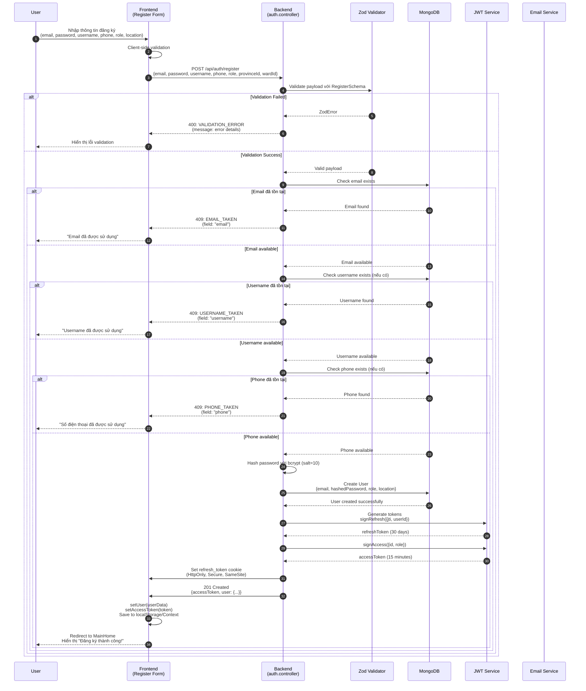
```mermaid
sequenceDiagram
    autonumber

    participant User
    participant Frontend as Frontend<br/>(Register Form)
    participant Backend as Backend<br/>(auth.controller)
    participant Validator as Zod Validator
    participant DB as MongoDB
    participant JWT as JWT Service
    participant Email as Email Service

    User->>Frontend: Nhập thông tin đăng ký<br/>(email, password, username, phone, role, location)
    Frontend->>Frontend: Client-side validation
    Frontend->>Backend: POST /api/auth/register<br/>{email, password, username, phone, role, provinceId, wardId}

    Backend->>Validator: Validate payload với RegisterSchema
    alt Validation Failed
        Validator-->>Backend: ZodError
        Backend-->>Frontend: 400: VALIDATION_ERROR<br/>(message: error details)
        Frontend-->>User: Hiển thị lỗi validation
    else Validation Success
        Validator-->>Backend: Valid payload

        %% Check Email Uniqueness
        Backend->>DB: Check email exists
        alt Email đã tồn tại
            DB-->>Backend: Email found
            Backend-->>Frontend: 409: EMAIL_TAKEN<br/>(field: "email")
            Frontend-->>User: "Email đã được sử dụng"
        else Email available
            DB-->>Backend: Email available

            %% Check Username Uniqueness
            Backend->>DB: Check username exists (nếu có)
            alt Username đã tồn tại
                DB-->>Backend: Username found
                Backend-->>Frontend: 409: USERNAME_TAKEN<br/>(field: "username")
                Frontend-->>User: "Username đã được sử dụng"
            else Username available
                DB-->>Backend: Username available

                %% Check Phone Uniqueness
                Backend->>DB: Check phone exists (nếu có)
                alt Phone đã tồn tại
                    DB-->>Backend: Phone found
                    Backend-->>Frontend: 409: PHONE_TAKEN<br/>(field: "phone")
                    Frontend-->>User: "Số điện thoại đã được sử dụng"
                else Phone available
                    DB-->>Backend: Phone available

                    %% Create User
                    Backend->>Backend: Hash password với bcrypt (salt=10)
                    Backend->>DB: Create User<br/>{email, hashedPassword, role, location}
                    DB-->>Backend: User created successfully

                    %% Generate Tokens
                    Backend->>JWT: Generate tokens<br/>signRefresh({jti, userId})
                    JWT-->>Backend: refreshToken (30 days)
                    Backend->>JWT: signAccess({id, role})
                    JWT-->>Backend: accessToken (15 minutes)

                    %% Set Cookie & Response
                    Backend->>Frontend: Set refresh_token cookie<br/>(HttpOnly, Secure, SameSite)
                    Backend->>Frontend: 201 Created<br/>{accessToken, user: {...}}

                    Frontend->>Frontend: setUser(userData)<br/>setAccessToken(token)<br/>Save to localStorage/Context
                    Frontend-->>User: Redirect to MainHome<br/>Hiển thị "Đăng ký thành công!"
                end
            end
        end
    end
```

**Key Points:**

- Validation đa lớp: Client → Zod Schema → Database Uniqueness
- Password được hash với bcrypt (10 salt rounds)
- Tự động login sau khi đăng ký (trả về accessToken)
- Refresh token được lưu trong HttpOnly cookie (bảo mật)
- Support nhiều role: Traveler, TourGuide, TravelAgency

---

## 2. Login (Đăng nhập)

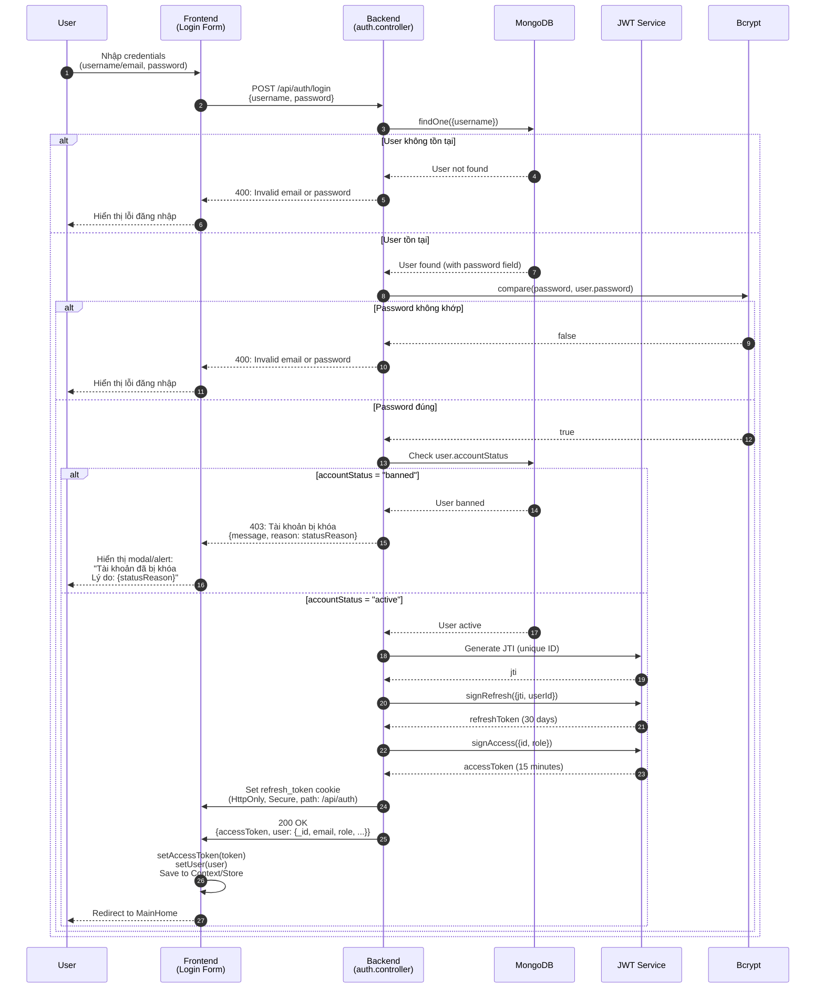
```mermaid
sequenceDiagram
    autonumber

    participant User
    participant Frontend as Frontend<br/>(Login Form)
    participant Backend as Backend<br/>(auth.controller)
    participant DB as MongoDB
    participant JWT as JWT Service
    participant Bcrypt as Bcrypt

    User->>Frontend: Nhập credentials<br/>(username/email, password)
    Frontend->>Backend: POST /api/auth/login<br/>{username, password}

    %% Find User
    Backend->>DB: findOne({username})
    alt User không tồn tại
        DB-->>Backend: User not found
        Backend-->>Frontend: 400: Invalid email or password
        Frontend-->>User: Hiển thị lỗi đăng nhập
    else User tồn tại
        DB-->>Backend: User found (with password field)

        %% Verify Password
        Backend->>Bcrypt: compare(password, user.password)
        alt Password không khớp
            Bcrypt-->>Backend: false
            Backend-->>Frontend: 400: Invalid email or password
            Frontend-->>User: Hiển thị lỗi đăng nhập
        else Password đúng
            Bcrypt-->>Backend: true

            %% Check Account Status
            Backend->>DB: Check user.accountStatus
            alt accountStatus = "banned"
                DB-->>Backend: User banned
                Backend-->>Frontend: 403: Tài khoản bị khóa<br/>{message, reason: statusReason}
                Frontend-->>User: Hiển thị modal/alert:<br/>"Tài khoản đã bị khóa<br/>Lý do: {statusReason}"
            else accountStatus = "active"
                DB-->>Backend: User active

                %% Generate Tokens
                Backend->>JWT: Generate JTI (unique ID)
                JWT-->>Backend: jti
                Backend->>JWT: signRefresh({jti, userId})
                JWT-->>Backend: refreshToken (30 days)
                Backend->>JWT: signAccess({id, role})
                JWT-->>Backend: accessToken (15 minutes)

                %% Set Cookie & Response
                Backend->>Frontend: Set refresh_token cookie<br/>(HttpOnly, Secure, path: /api/auth)
                Backend->>Frontend: 200 OK<br/>{accessToken, user: {_id, email, role, ...}}

                Frontend->>Frontend: setAccessToken(token)<br/>setUser(user)<br/>Save to Context/Store
                Frontend-->>User: Redirect to MainHome
            end
        end
    end
```

**Key Points:**

- Username có thể là email hoặc username
- Password verification với bcrypt.compare
- Real-time check banned status
- Dual token system: Access Token (short-lived) + Refresh Token (long-lived)
- Refresh token chỉ gửi qua cookie, không expose trong response body

---

## 3. Logout (Đăng xuất)

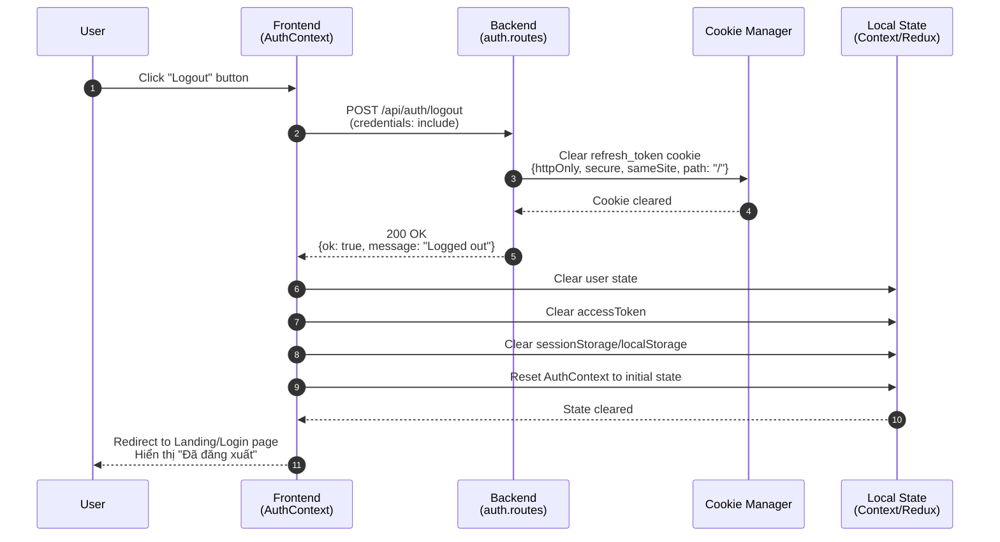
```mermaid
sequenceDiagram
    autonumber

    participant User
    participant Frontend as Frontend<br/>(AuthContext)
    participant Backend as Backend<br/>(auth.routes)
    participant Cookie as Cookie Manager
    participant LocalState as Local State<br/>(Context/Redux)

    User->>Frontend: Click "Logout" button
    Frontend->>Backend: POST /api/auth/logout<br/>(credentials: include)

    %% Backend clears cookie
    Backend->>Cookie: Clear refresh_token cookie<br/>{httpOnly, secure, sameSite, path: "/"}
    Cookie-->>Backend: Cookie cleared

    Backend-->>Frontend: 200 OK<br/>{ok: true, message: "Logged out"}

    %% Frontend cleanup
    Frontend->>LocalState: Clear user state
    Frontend->>LocalState: Clear accessToken
    Frontend->>LocalState: Clear sessionStorage/localStorage
    Frontend->>LocalState: Reset AuthContext to initial state

    LocalState-->>Frontend: State cleared
    Frontend-->>User: Redirect to Landing/Login page<br/>Hiển thị "Đã đăng xuất"
```

**Key Points:**

- Cookie được xóa hoàn toàn (path: "/" để clear toàn bộ scope)
- Frontend cleanup tất cả authentication state
- Redirect về trang public (Landing hoặc Login)
- Logout luôn trả về 200 OK (ngay cả khi có lỗi nhỏ)

---

## 4. Change Password (Đổi mật khẩu)

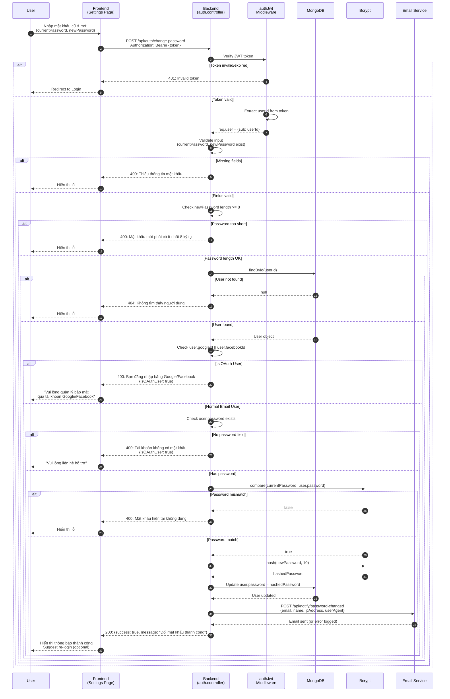
```mermaid
sequenceDiagram
    autonumber

    participant User
    participant Frontend as Frontend<br/>(Settings Page)
    participant Backend as Backend<br/>(auth.controller)
    participant AuthMiddleware as authJwt<br/>Middleware
    participant DB as MongoDB
    participant Bcrypt as Bcrypt
    participant Email as Email Service

    User->>Frontend: Nhập mật khẩu cũ & mới<br/>(currentPassword, newPassword)
    Frontend->>Backend: POST /api/auth/change-password<br/>Authorization: Bearer {token}

    %% JWT Verification
    Backend->>AuthMiddleware: Verify JWT token
    alt Token invalid/expired
        AuthMiddleware-->>Frontend: 401: Invalid token
        Frontend-->>User: Redirect to Login
    else Token valid
        AuthMiddleware->>AuthMiddleware: Extract userId from token
        AuthMiddleware-->>Backend: req.user = {sub: userId}

        %% Validation
        Backend->>Backend: Validate input<br/>(currentPassword, newPassword exist)
        alt Missing fields
            Backend-->>Frontend: 400: Thiếu thông tin mật khẩu
            Frontend-->>User: Hiển thị lỗi
        else Fields valid
            Backend->>Backend: Check newPassword length >= 8
            alt Password too short
                Backend-->>Frontend: 400: Mật khẩu mới phải có ít nhất 8 ký tự
                Frontend-->>User: Hiển thị lỗi
            else Password length OK

                %% Find User
                Backend->>DB: findById(userId)
                alt User not found
                    DB-->>Backend: null
                    Backend-->>Frontend: 404: Không tìm thấy người dùng
                    Frontend-->>User: Hiển thị lỗi
                else User found
                    DB-->>Backend: User object

                    %% Check OAuth User
                    Backend->>Backend: Check user.googleId || user.facebookId
                    alt Is OAuth User
                        Backend-->>Frontend: 400: Bạn đăng nhập bằng Google/Facebook<br/>{isOAuthUser: true}
                        Frontend-->>User: "Vui lòng quản lý bảo mật<br/>qua tài khoản Google/Facebook"
                    else Normal Email User

                        Backend->>Backend: Check user.password exists
                        alt No password field
                            Backend-->>Frontend: 400: Tài khoản không có mật khẩu<br/>{isOAuthUser: true}
                            Frontend-->>User: "Vui lòng liên hệ hỗ trợ"
                        else Has password

                            %% Verify Current Password
                            Backend->>Bcrypt: compare(currentPassword, user.password)
                            alt Password mismatch
                                Bcrypt-->>Backend: false
                                Backend-->>Frontend: 400: Mật khẩu hiện tại không đúng
                                Frontend-->>User: Hiển thị lỗi
                            else Password match
                                Bcrypt-->>Backend: true

                                %% Update Password
                                Backend->>Bcrypt: hash(newPassword, 10)
                                Bcrypt-->>Backend: hashedPassword
                                Backend->>DB: Update user.password = hashedPassword
                                DB-->>Backend: User updated

                                %% Send Email Notification
                                Backend->>Email: POST /api/notify/password-changed<br/>{email, name, ipAddress, userAgent}
                                Email-->>Backend: Email sent (or error logged)

                                Backend-->>Frontend: 200: {success: true, message: "Đổi mật khẩu thành công"}
                                Frontend-->>User: Hiển thị thông báo thành công<br/>Suggest re-login (optional)
                            end
                        end
                    end
                end
            end
        end
    end
```

**Key Points:**

- Require authentication (authJwt middleware)
- Prevent OAuth users từ changing password (họ dùng Google/Facebook)
- Verify current password trước khi change
- Minimum 8 characters cho new password
- Send email notification sau khi change thành công
- Email chứa thông tin: IP address, User Agent (security audit)

---

## 5. Add Tour to Cart (Thêm tour vào giỏ hàng)

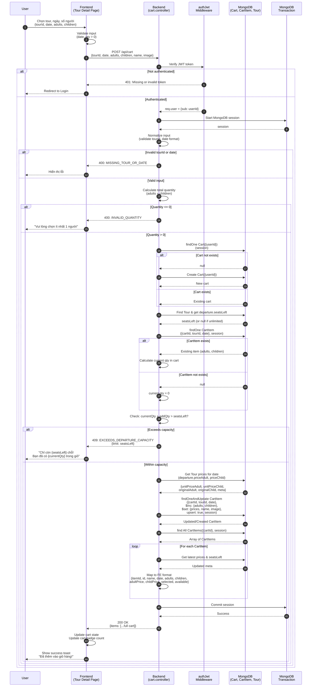
```mermaid
sequenceDiagram
    autonumber

    participant User
    participant Frontend as Frontend<br/>(Tour Detail Page)
    participant Backend as Backend<br/>(cart.controller)
    participant AuthMiddleware as authJwt<br/>Middleware
    participant DB as MongoDB<br/>(Cart, CartItem, Tour)
    participant Transaction as MongoDB<br/>Transaction

    User->>Frontend: Chọn tour, ngày, số người<br/>(tourId, date, adults, children)
    Frontend->>Frontend: Validate input<br/>(date, qty > 0)
    Frontend->>Backend: POST /api/cart<br/>{tourId, date, adults, children, name, image}

    %% Auth Check
    Backend->>AuthMiddleware: Verify JWT token
    alt Not authenticated
        AuthMiddleware-->>Frontend: 401: Missing or invalid token
        Frontend-->>User: Redirect to Login
    else Authenticated
        AuthMiddleware-->>Backend: req.user = {sub: userId}

        %% Start Transaction
        Backend->>Transaction: Start MongoDB session
        Transaction-->>Backend: session

        Backend->>Backend: Normalize input<br/>(validate tourId, date format)
        alt Invalid tourId or date
            Backend-->>Frontend: 400: MISSING_TOUR_OR_DATE
            Frontend-->>User: Hiển thị lỗi
        else Valid input

            Backend->>Backend: Calculate total quantity<br/>(adults + children)
            alt Quantity <= 0
                Backend-->>Frontend: 400: INVALID_QUANTITY
                Frontend-->>User: "Vui lòng chọn ít nhất 1 người"
            else Quantity > 0

                %% Get or Create Cart
                Backend->>DB: findOne Cart({userId})<br/>(session)
                alt Cart not exists
                    DB-->>Backend: null
                    Backend->>DB: Create Cart({userId})
                    DB-->>Backend: New cart
                else Cart exists
                    DB-->>Backend: Existing cart
                end

                %% Check Seats Availability
                Backend->>DB: Find Tour & get departure.seatsLeft
                DB-->>Backend: seatsLeft (or null if unlimited)

                %% Check Existing Cart Item
                Backend->>DB: findOne CartItem<br/>({cartId, tourId, date}, session)
                alt CartItem exists
                    DB-->>Backend: Existing item (adults, children)
                    Backend->>Backend: Calculate current qty in cart
                else CartItem not exists
                    DB-->>Backend: null
                    Backend->>Backend: current qty = 0
                end

                %% Capacity Guard
                Backend->>Backend: Check: currentQty + addQty > seatsLeft?
                alt Exceeds capacity
                    Backend-->>Frontend: 409: EXCEEDS_DEPARTURE_CAPACITY<br/>{limit: seatsLeft}
                    Frontend-->>User: "Chỉ còn {seatsLeft} chỗ!<br/>Bạn đã có {currentQty} trong giỏ"
                else Within capacity

                    %% Get Price Snapshot
                    Backend->>DB: Get Tour prices for date<br/>(departure.priceAdult, priceChild)
                    DB-->>Backend: {unitPriceAdult, unitPriceChild,<br/>originalAdult, originalChild, meta}

                    %% Upsert Cart Item
                    Backend->>DB: findOneAndUpdate CartItem<br/>({cartId, tourId, date},<br/>$inc: {adults, children},<br/>$set: {prices, name, image},<br/>upsert: true, session)
                    DB-->>Backend: Updated/Created CartItem

                    %% Get Full Cart
                    Backend->>DB: find All CartItems({cartId}, session)
                    DB-->>Backend: Array of CartItems

                    %% Enrich with latest prices
                    loop For each CartItem
                        Backend->>DB: Get latest prices & seatsLeft
                        DB-->>Backend: Updated meta
                        Backend->>Backend: Map to FE format<br/>{itemId, id, name, date, adults, children,<br/>adultPrice, childPrice, selected, available}
                    end

                    %% Commit Transaction
                    Backend->>Transaction: Commit session
                    Transaction-->>Backend: Success

                    Backend-->>Frontend: 200 OK<br/>{items: [...full cart]}
                    Frontend->>Frontend: Update cart state<br/>Update cart badge count
                    Frontend-->>User: Show success toast<br/>"Đã thêm vào giỏ hàng!"
                end
            end
        end
    end
```

**Key Points:**

- **Transaction-based**: Sử dụng MongoDB transaction để đảm bảo atomicity
- **Capacity Guard**: Kiểm tra số chỗ còn lại trước khi add (prevent overbooking)
- **Price Snapshot**: Lưu giá tại thời điểm add vào cart (không tin FE)
- **Upsert Logic**: Nếu tour + date đã có → cộng dồn số lượng
- **Real-time pricing**: Mỗi lần trả cart, refresh lại giá từ Tour (case giá thay đổi)
- **Race condition handling**: Unique index (cartId, tourId, date) + error 11000 handling

---

## 6. Wishlist Operations (Quản lý yêu thích)

### 6.1. Add to Wishlist

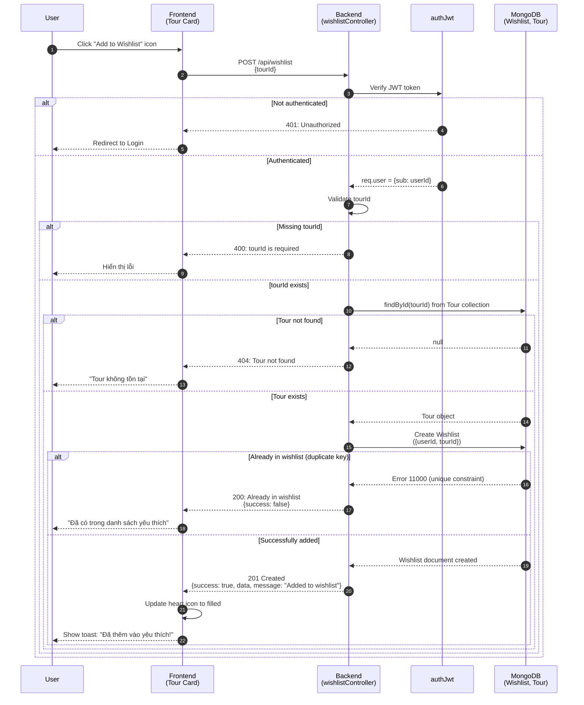
```mermaid
sequenceDiagram
    autonumber

    participant User
    participant Frontend as Frontend<br/>(Tour Card)
    participant Backend as Backend<br/>(wishlistController)
    participant AuthMiddleware as authJwt
    participant DB as MongoDB<br/>(Wishlist, Tour)

    User->>Frontend: Click "Add to Wishlist" icon
    Frontend->>Backend: POST /api/wishlist<br/>{tourId}

    Backend->>AuthMiddleware: Verify JWT token
    alt Not authenticated
        AuthMiddleware-->>Frontend: 401: Unauthorized
        Frontend-->>User: Redirect to Login
    else Authenticated
        AuthMiddleware-->>Backend: req.user = {sub: userId}

        Backend->>Backend: Validate tourId
        alt Missing tourId
            Backend-->>Frontend: 400: tourId is required
            Frontend-->>User: Hiển thị lỗi
        else tourId exists

            %% Check Tour Exists
            Backend->>DB: findById(tourId) from Tour collection
            alt Tour not found
                DB-->>Backend: null
                Backend-->>Frontend: 404: Tour not found
                Frontend-->>User: "Tour không tồn tại"
            else Tour exists
                DB-->>Backend: Tour object

                %% Create Wishlist Entry
                Backend->>DB: Create Wishlist<br/>({userId, tourId})
                alt Already in wishlist (duplicate key)
                    DB-->>Backend: Error 11000 (unique constraint)
                    Backend-->>Frontend: 200: Already in wishlist<br/>{success: false}
                    Frontend-->>User: "Đã có trong danh sách yêu thích"
                else Successfully added
                    DB-->>Backend: Wishlist document created
                    Backend-->>Frontend: 201 Created<br/>{success: true, data, message: "Added to wishlist"}
                    Frontend->>Frontend: Update heart icon to filled
                    Frontend-->>User: Show toast: "Đã thêm vào yêu thích!"
                end
            end
        end
    end
```

### 6.2. Remove from Wishlist

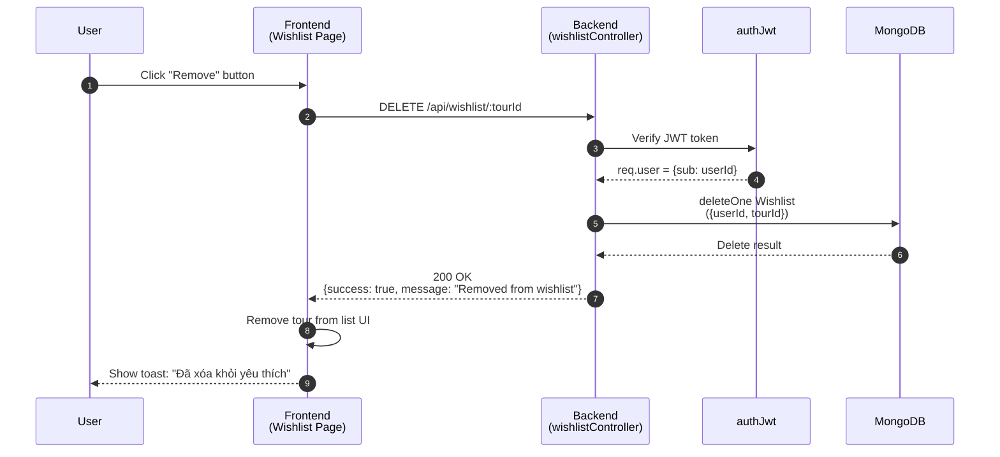
```mermaid
sequenceDiagram
    autonumber

    participant User
    participant Frontend as Frontend<br/>(Wishlist Page)
    participant Backend as Backend<br/>(wishlistController)
    participant AuthMiddleware as authJwt
    participant DB as MongoDB

    User->>Frontend: Click "Remove" button
    Frontend->>Backend: DELETE /api/wishlist/:tourId

    Backend->>AuthMiddleware: Verify JWT token
    AuthMiddleware-->>Backend: req.user = {sub: userId}

    Backend->>DB: deleteOne Wishlist<br/>({userId, tourId})
    DB-->>Backend: Delete result

    Backend-->>Frontend: 200 OK<br/>{success: true, message: "Removed from wishlist"}
    Frontend->>Frontend: Remove tour from list UI
    Frontend-->>User: Show toast: "Đã xóa khỏi yêu thích"
```

### 6.3. Toggle Wishlist (Smart Add/Remove)

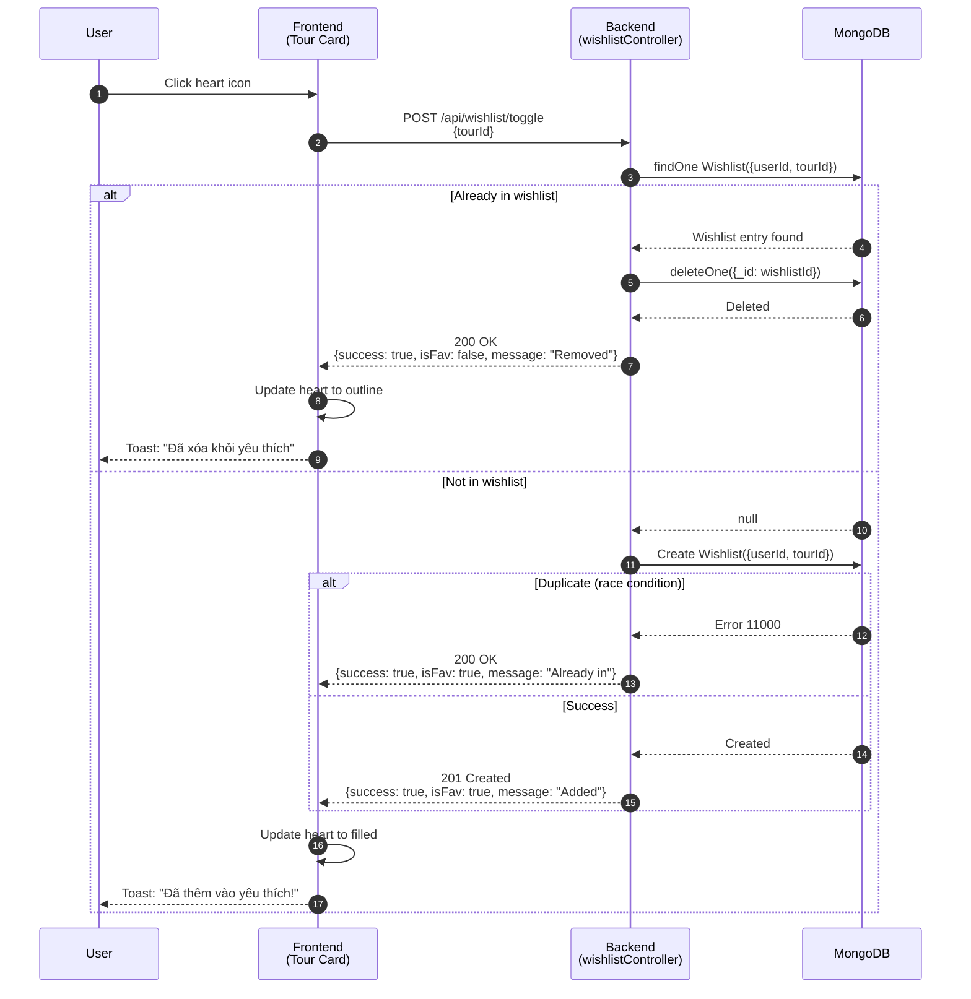
```mermaid
sequenceDiagram
    autonumber

    participant User
    participant Frontend as Frontend<br/>(Tour Card)
    participant Backend as Backend<br/>(wishlistController)
    participant DB as MongoDB

    User->>Frontend: Click heart icon
    Frontend->>Backend: POST /api/wishlist/toggle<br/>{tourId}

    Backend->>DB: findOne Wishlist({userId, tourId})
    alt Already in wishlist
        DB-->>Backend: Wishlist entry found
        Backend->>DB: deleteOne({_id: wishlistId})
        DB-->>Backend: Deleted
        Backend-->>Frontend: 200 OK<br/>{success: true, isFav: false, message: "Removed"}
        Frontend->>Frontend: Update heart to outline
        Frontend-->>User: Toast: "Đã xóa khỏi yêu thích"
    else Not in wishlist
        DB-->>Backend: null
        Backend->>DB: Create Wishlist({userId, tourId})
        alt Duplicate (race condition)
            DB-->>Backend: Error 11000
            Backend-->>Frontend: 200 OK<br/>{success: true, isFav: true, message: "Already in"}
        else Success
            DB-->>Backend: Created
            Backend-->>Frontend: 201 Created<br/>{success: true, isFav: true, message: "Added"}
        end
        Frontend->>Frontend: Update heart to filled
        Frontend-->>User: Toast: "Đã thêm vào yêu thích!"
    end
```

### 6.4. Get My Wishlist

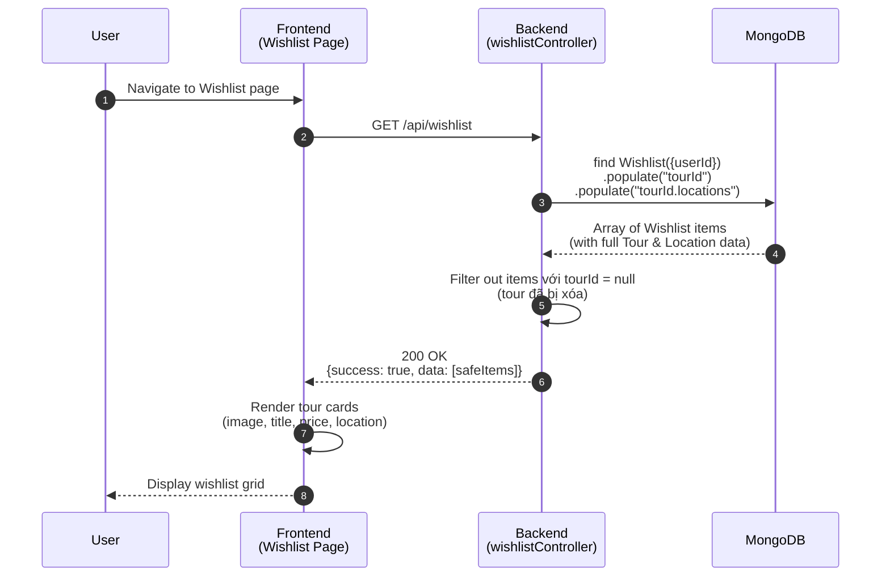
```mermaid
sequenceDiagram
    autonumber

    participant User
    participant Frontend as Frontend<br/>(Wishlist Page)
    participant Backend as Backend<br/>(wishlistController)
    participant DB as MongoDB

    User->>Frontend: Navigate to Wishlist page
    Frontend->>Backend: GET /api/wishlist

    Backend->>DB: find Wishlist({userId})<br/>.populate("tourId")<br/>.populate("tourId.locations")
    DB-->>Backend: Array of Wishlist items<br/>(with full Tour & Location data)

    Backend->>Backend: Filter out items với tourId = null<br/>(tour đã bị xóa)
    Backend-->>Frontend: 200 OK<br/>{success: true, data: [safeItems]}

    Frontend->>Frontend: Render tour cards<br/>(image, title, price, location)
    Frontend-->>User: Display wishlist grid
```

### 6.5. Check Many Tours (Bulk Check)

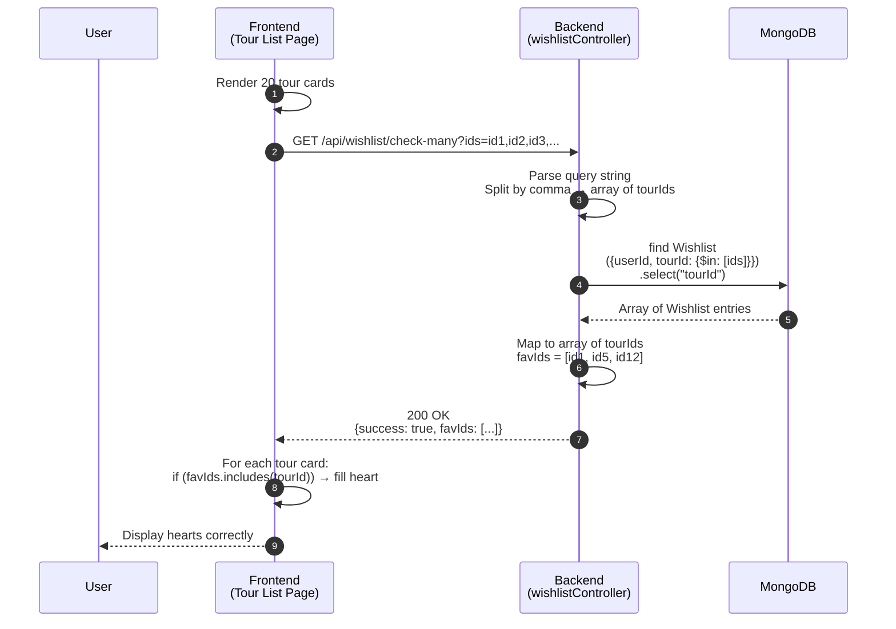
```mermaid
sequenceDiagram
    autonumber

    participant User
    participant Frontend as Frontend<br/>(Tour List Page)
    participant Backend as Backend<br/>(wishlistController)
    participant DB as MongoDB

    Frontend->>Frontend: Render 20 tour cards
    Frontend->>Backend: GET /api/wishlist/check-many?ids=id1,id2,id3,...

    Backend->>Backend: Parse query string<br/>Split by comma → array of tourIds
    Backend->>DB: find Wishlist<br/>({userId, tourId: {$in: [ids]}})<br/>.select("tourId")
    DB-->>Backend: Array of Wishlist entries

    Backend->>Backend: Map to array of tourIds<br/>favIds = [id1, id5, id12]
    Backend-->>Frontend: 200 OK<br/>{success: true, favIds: [...]}

    Frontend->>Frontend: For each tour card:<br/>if (favIds.includes(tourId)) → fill heart
    Frontend-->>User: Display hearts correctly
```

**Key Points:**

- **Unique constraint**: (userId, tourId) → ngăn duplicate
- **Soft delete safe**: Filter tourId = null (tour đã xóa)
- **Populate cascade**: Tour → Locations (1 query)
- **Bulk check optimization**: 1 API call cho nhiều tours
- **Toggle UX**: Smart add/remove với 1 click

---

## 7. Payment Processing (Thanh toán)

### 7.1. MoMo Payment Flow


```mermaid
sequenceDiagram
    autonumber

    participant User
    participant Frontend as Frontend<br/>(Checkout Page)
    participant Backend as Backend<br/>(payment.controller)
    participant AuthMiddleware as authJwt
    participant DB as MongoDB<br/>(PaymentSession, Cart, Tour)
    participant MoMo as MoMo API
    participant Email as Email Service

    User->>Frontend: Click "Thanh toán với MoMo"<br/>(mode: cart/buy-now/retry)
    Frontend->>Backend: POST /api/payments/momo<br/>{mode, items, amount, voucherCode}

    Backend->>AuthMiddleware: Verify JWT token
    alt Not authenticated
        AuthMiddleware-->>Frontend: 401: Unauthorized
        Frontend-->>User: Redirect to Login
    else Authenticated
        AuthMiddleware-->>Backend: req.user = {sub: userId}

        %% Server-side Amount Calculation
        Backend->>Backend: buildMoMoCharge(userId, body)<br/>Recalculate amount from server state

        alt mode = "cart"
            Backend->>DB: Find Cart & selected CartItems
            DB-->>Backend: CartItems array
            Backend->>DB: Get prices for each tour+date
            DB-->>Backend: Prices & meta
        else mode = "buy-now"
            Backend->>Backend: Extract tour from body.item
            Backend->>DB: Get prices for tour+date
            DB-->>Backend: Prices & meta
        else mode = "retry-payment"
            Backend->>Backend: Extract retryItems from body
            Backend->>Backend: Use stored prices
        end

        Backend->>Backend: Calculate totalVND<br/>Apply voucher discount<br/>Cap for MoMo test limit (10M VNĐ)

        alt Amount invalid
            Backend-->>Frontend: 400: INVALID_AMOUNT
            Frontend-->>User: Hiển thị lỗi
        else Amount valid

            %% Create PaymentSession
            Backend->>DB: Create PaymentSession<br/>{userId, provider: "momo", orderId,<br/>items, amount, voucherCode}
            DB-->>Backend: PaymentSession created

            %% Hold Seats Temporarily
            Backend->>DB: Hold seats for payment<br/>(reduce seatsLeft temporarily)
            DB-->>Backend: Seats held
            Backend->>Backend: Set timeout (1 min)<br/>to release seats if unpaid

            %% Create MoMo Payment
            Backend->>Backend: Build signature<br/>HMAC-SHA256(rawSignature, secretKey)
            Backend->>MoMo: POST /v2/gateway/api/create<br/>{partnerCode, amount, orderId, signature}

            alt MoMo API Error
                MoMo-->>Backend: Error response
                Backend->>DB: Delete PaymentSession
                Backend->>DB: Release held seats
                Backend-->>Frontend: 502: MOMO_CREATE_FAILED
                Frontend-->>User: "Không thể tạo thanh toán"
            else MoMo Success
                MoMo-->>Backend: {payUrl, deeplink, resultCode: 0}

                Backend-->>Frontend: 200 OK<br/>{payUrl, orderId, deeplink}
                Frontend->>Frontend: Redirect to payUrl<br/>(MoMo checkout page)
                Frontend-->>User: Show MoMo payment UI

                %% User completes payment on MoMo
                User->>MoMo: Complete payment<br/>(scan QR, enter OTP)

                %% MoMo sends IPN to backend
                MoMo->>Backend: POST /api/payments/momo/ipn<br/>{orderId, resultCode, signature}

                Backend->>Backend: Verify signature<br/>HMAC-SHA256(ipnRawSignature)
                alt Signature invalid
                    Backend-->>MoMo: 400: BAD_SIGNATURE
                else Signature valid
                    Backend->>DB: Find PaymentSession by orderId

                    alt resultCode = 0 (Success)
                        DB-->>Backend: PaymentSession found
                        Backend->>DB: Update session.status = "paid"<br/>session.paidAt = now

                        %% Confirm Seats Permanently
                        Backend->>Backend: Confirm held seats<br/>(seats already reduced)

                        %% Mark Voucher as Used
                        alt Has voucherCode
                            Backend->>DB: Find Promotion by code
                            DB-->>Backend: Promotion found
                            Backend->>DB: Increment promotion.usageCount<br/>Add to user.usedPromotions
                        end

                        %% Create Booking
                        Backend->>DB: Create Booking<br/>{userId, items, totalAmount,<br/>status: "paid", payment: {...}}
                        DB-->>Backend: Booking created

                        %% Clear Cart
                        Backend->>DB: Delete selected CartItems
                        DB-->>Backend: Cart cleared

                        %% Send Email
                        Backend->>Email: Send payment success email
                        Email-->>Backend: Email sent

                        Backend-->>MoMo: 200 OK

                    else resultCode != 0 (Failed)
                        DB-->>Backend: PaymentSession found
                        Backend->>DB: Update session.status = "failed"

                        %% Release Seats
                        Backend->>DB: Release held seats<br/>(restore seatsLeft)

                        %% Restore Cart
                        Backend->>DB: Restore items to cart
                        DB-->>Backend: Cart restored

                        %% Create Failed Booking
                        Backend->>DB: Create Booking<br/>{status: "cancelled",<br/>payment.status: "failed"}

                        Backend-->>MoMo: 200 OK
                    end
                end

                %% MoMo redirects user back
                MoMo->>Frontend: Redirect to redirectUrl<br/>?orderId=xxx&resultCode=0
                Frontend->>Backend: POST /api/payments/momo/mark-paid<br/>{orderId, resultCode}
                Backend->>DB: Find PaymentSession & Booking
                DB-->>Backend: Session & Booking data
                Backend-->>Frontend: {success: true, bookingId}
                Frontend-->>User: Redirect to Success page<br/>Show booking details
            end
        end
    end
```

### 7.2. Retry Payment Flow


```mermaid
sequenceDiagram
    autonumber

    participant User
    participant Frontend as Frontend<br/>(Order History Page)
    participant Backend as Backend<br/>(payment.controller)
    participant AuthMiddleware as authJwt
    participant DB as MongoDB<br/>(Booking, Tour)
    participant MoMo as MoMo API

    User->>Frontend: View failed/cancelled booking<br/>Click "Retry Payment"
    Frontend->>Backend: POST /api/payments/momo<br/>{mode: "retry-payment", bookingId}

    Backend->>AuthMiddleware: Verify JWT token
    AuthMiddleware-->>Backend: req.user = {sub: userId}

    %% Fetch Failed Booking
    Backend->>DB: findById Booking({bookingId, userId})
    alt Booking not found
        DB-->>Backend: null
        Backend-->>Frontend: 404: BOOKING_NOT_FOUND
        Frontend-->>User: "Không tìm thấy đơn hàng"
    else Booking found
        DB-->>Backend: Booking object

        %% Validate Booking Status
        Backend->>Backend: Check booking.payment.status
        alt Status = "paid"
            Backend-->>Frontend: 400: ALREADY_PAID
            Frontend-->>User: "Đơn hàng đã được thanh toán"
        else Status = "failed" or "cancelled"

            %% Extract Retry Items
            Backend->>Backend: Extract items from booking<br/>{tourId, date, adults, children,<br/>unitPriceAdult, unitPriceChild}

            %% Re-check Seats Availability
            loop For each item
                Backend->>DB: Get tour departure seatsLeft
                DB-->>Backend: Current seatsLeft

                Backend->>Backend: Check: item.qty <= seatsLeft?
                alt Insufficient seats
                    Backend-->>Frontend: 409: INSUFFICIENT_SEATS<br/>{tourName, requested, available}
                    Frontend-->>User: "Tour {name} chỉ còn {available} chỗ"
                end
            end

            %% Re-check Voucher Validity
            alt Has voucherCode
                Backend->>DB: Find Promotion by code
                alt Voucher expired/maxed out
                    DB-->>Backend: Invalid voucher
                    Backend->>Backend: Remove voucherCode<br/>Recalculate amount without discount
                    Backend->>Frontend: Warning: VOUCHER_INVALID<br/>(continue without voucher)
                else Voucher valid
                    DB-->>Backend: Promotion valid
                    Backend->>Backend: Apply discount
                end
            end

            %% Calculate Amount (use stored prices)
            Backend->>Backend: Calculate totalVND from stored prices<br/>Apply voucher discount (if any)<br/>Cap for MoMo test limit (10M VNĐ)

            %% Create New PaymentSession
            Backend->>DB: Create PaymentSession<br/>{userId, provider: "momo",<br/>orderId: newOrderId,<br/>originalBookingId: bookingId,<br/>items: retryItems, amount}
            DB-->>Backend: PaymentSession created

            %% Hold Seats
            Backend->>DB: Hold seats temporarily (1 min timeout)
            DB-->>Backend: Seats held

            %% Create MoMo Payment
            Backend->>Backend: Build signature<br/>HMAC-SHA256(rawSignature)
            Backend->>MoMo: POST /v2/gateway/api/create<br/>{partnerCode, amount, orderId: newOrderId}

            alt MoMo API Error
                MoMo-->>Backend: Error response
                Backend->>DB: Delete PaymentSession<br/>Release held seats
                Backend-->>Frontend: 502: MOMO_CREATE_FAILED
                Frontend-->>User: "Không thể tạo thanh toán"
            else MoMo Success
                MoMo-->>Backend: {payUrl, deeplink, resultCode: 0}

                Backend-->>Frontend: 200 OK<br/>{payUrl, orderId: newOrderId, deeplink}
                Frontend->>Frontend: Redirect to payUrl
                Frontend-->>User: Show MoMo payment UI

                %% User completes payment
                User->>MoMo: Complete payment<br/>(scan QR, enter OTP)

                %% MoMo IPN Callback
                MoMo->>Backend: POST /api/payments/momo/ipn<br/>{orderId: newOrderId, resultCode}

                Backend->>Backend: Verify signature
                Backend->>DB: Find PaymentSession by newOrderId

                alt resultCode = 0 (Success)
                    DB-->>Backend: PaymentSession found
                    Backend->>DB: Update session.status = "paid"

                    %% Confirm Seats
                    Backend->>DB: Confirm held seats permanently

                    %% Mark Voucher as Used
                    Backend->>DB: Increment promotion.usageCount<br/>Add to user.usedPromotions

                    %% Update Original Booking
                    Backend->>DB: Update Booking({bookingId})<br/>status = "paid"<br/>payment.status = "paid"<br/>payment.paidAt = now<br/>payment.orderId = newOrderId<br/>totalAmount = new amount (if changed)
                    DB-->>Backend: Booking updated

                    %% Send Email
                    Backend->>Backend: Send payment success email

                    Backend-->>MoMo: 200 OK

                else resultCode != 0 (Failed Again)
                    Backend->>DB: Update session.status = "failed"<br/>Release seats
                    Backend->>DB: Keep booking status = "cancelled"<br/>Increment booking.payment.retryCount
                    Backend-->>MoMo: 200 OK
                end

                %% MoMo redirects user
                MoMo->>Frontend: Redirect to redirectUrl<br/>?orderId=newOrderId&resultCode=0
                Frontend->>Backend: POST /api/payments/momo/mark-paid<br/>{orderId: newOrderId}
                Backend->>DB: Find Booking by orderId
                DB-->>Backend: Updated booking
                Backend-->>Frontend: {success: true, bookingId}
                Frontend-->>User: Redirect to Success page<br/>"Thanh toán thành công!"
            end
        end
    end
```

### 7.3. PayPal Payment Flow

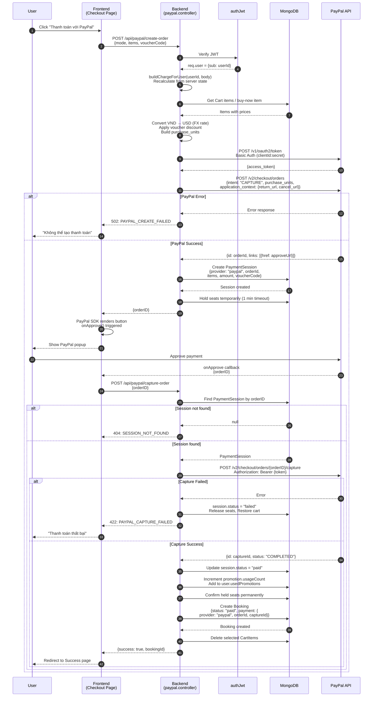
```mermaid
sequenceDiagram
    autonumber

    participant User
    participant Frontend as Frontend<br/>(Checkout Page)
    participant Backend as Backend<br/>(paypal.controller)
    participant AuthMiddleware as authJwt
    participant DB as MongoDB
    participant PayPal as PayPal API

    User->>Frontend: Click "Thanh toán với PayPal"
    Frontend->>Backend: POST /api/paypal/create-order<br/>{mode, items, voucherCode}

    Backend->>AuthMiddleware: Verify JWT
    AuthMiddleware-->>Backend: req.user = {sub: userId}

    %% Build Charge
    Backend->>Backend: buildChargeForUser(userId, body)<br/>Recalculate from server state
    Backend->>DB: Get Cart items / buy-now item
    DB-->>Backend: Items with prices

    Backend->>Backend: Convert VND → USD (FX rate)<br/>Apply voucher discount<br/>Build purchase_units

    %% Get PayPal OAuth Token
    Backend->>PayPal: POST /v1/oauth2/token<br/>Basic Auth (clientId:secret)
    PayPal-->>Backend: {access_token}

    %% Create PayPal Order
    Backend->>PayPal: POST /v2/checkout/orders<br/>{intent: "CAPTURE", purchase_units,<br/>application_context: {return_url, cancel_url}}

    alt PayPal Error
        PayPal-->>Backend: Error response
        Backend-->>Frontend: 502: PAYPAL_CREATE_FAILED
        Frontend-->>User: "Không thể tạo thanh toán"
    else PayPal Success
        PayPal-->>Backend: {id: orderId, links: [{href: approveUrl}]}

        %% Save PaymentSession
        Backend->>DB: Create PaymentSession<br/>{provider: "paypal", orderId,<br/>items, amount, voucherCode}
        DB-->>Backend: Session created

        %% Hold Seats
        Backend->>DB: Hold seats temporarily (1 min timeout)

        Backend-->>Frontend: {orderID}
        Frontend->>Frontend: PayPal SDK renders button<br/>onApprove() triggered
        Frontend-->>User: Show PayPal popup

        %% User approves on PayPal
        User->>PayPal: Approve payment
        PayPal-->>Frontend: onApprove callback<br/>{orderID}

        %% Capture Payment
        Frontend->>Backend: POST /api/paypal/capture-order<br/>{orderID}
        Backend->>DB: Find PaymentSession by orderID

        alt Session not found
            DB-->>Backend: null
            Backend-->>Frontend: 404: SESSION_NOT_FOUND
        else Session found
            DB-->>Backend: PaymentSession

            Backend->>PayPal: POST /v2/checkout/orders/{orderID}/capture<br/>Authorization: Bearer {token}

            alt Capture Failed
                PayPal-->>Backend: Error
                Backend->>DB: session.status = "failed"<br/>Release seats, Restore cart
                Backend-->>Frontend: 422: PAYPAL_CAPTURE_FAILED
                Frontend-->>User: "Thanh toán thất bại"
            else Capture Success
                PayPal-->>Backend: {id: captureId, status: "COMPLETED"}

                Backend->>DB: Update session.status = "paid"

                %% Mark Voucher as Used
                Backend->>DB: Increment promotion.usageCount<br/>Add to user.usedPromotions

                %% Confirm Seats
                Backend->>DB: Confirm held seats permanently

                %% Create Booking
                Backend->>DB: Create Booking<br/>{status: "paid", payment: {<br/>provider: "paypal", orderId, captureId}}
                DB-->>Backend: Booking created

                %% Clear Cart
                Backend->>DB: Delete selected CartItems

                Backend-->>Frontend: {success: true, bookingId}
                Frontend-->>User: Redirect to Success page
            end
        end
    end
```

**Key Points:**

- **Dual Payment Methods**: MoMo (VNĐ) và PayPal (USD với FX conversion)
- **Server-side Amount Recalculation**: Không tin amount từ FE, luôn tính lại từ DB
- **Seat Holding**: Hold chỗ trong 1 phút khi tạo payment, release nếu timeout/failed
- **IPN Security**: Verify signature từ MoMo/PayPal để đảm bảo tính toàn vẹn
- **Idempotent Booking Creation**: Check duplicate booking trước khi tạo mới
- **Voucher Management**: Tự động mark voucher as used khi payment success
- **Transaction Safety**: Sử dụng MongoDB transaction cho PayPal capture
- **Failed Payment Handling**: Release seats + restore cart items khi failed
- **Retry Payment Features**:
  - Support retry cho failed/cancelled bookings (mode: "retry-payment")
  - Re-check seats availability trước khi retry (tránh overbooking)
  - Re-validate voucher (voucher có thể hết hạn/maxed out)
  - Use stored prices từ original booking (không lấy giá mới)
  - Update original booking thay vì tạo booking mới
  - Track retry count để monitor failed patterns
  - Auto-remove invalid voucher và continue without discount
  - Link originalBookingId trong PaymentSession để audit trail

---

## 8. Refund System (Hệ thống hoàn tiền)

### 8.1. Class Diagram

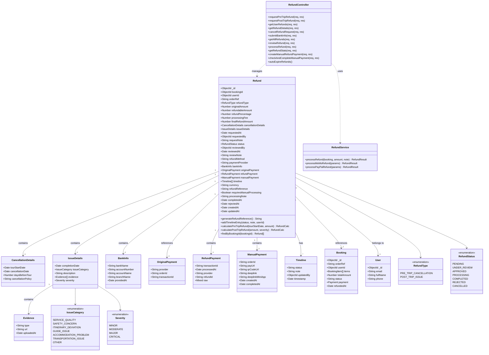
```mermaid
classDiagram
    class Refund {
        +ObjectId _id
        +ObjectId bookingId
        +ObjectId userId
        +String orderRef
        +RefundType refundType
        +Number originalAmount
        +Number refundableAmount
        +Number refundPercentage
        +Number processingFee
        +Number finalRefundAmount
        +CancellationDetails cancellationDetails
        +IssueDetails issueDetails
        +Date requestedAt
        +ObjectId requestedBy
        +String requestNote
        +RefundStatus status
        +ObjectId reviewedBy
        +Date reviewedAt
        +String reviewNote
        +String refundMethod
        +String paymentProvider
        +BankInfo bankInfo
        +OriginalPayment originalPayment
        +RefundPayment refundPayment
        +ManualPayment manualPayment
        +Timeline[] timeline
        +String currency
        +String refundReference
        +Boolean requiresManualProcessing
        +String processingNote
        +Date completedAt
        +Date rejectedAt
        +Date createdAt
        +Date updatedAt
        +generateRefundReference() String
        +addTimelineEntry(status, note, userId)
        +calculatePreTripRefund(tourStartDate, amount) RefundCalc
        +calculatePostTripRefund(amount, severity) RefundCalc
        +findByBookingId(bookingId) Refund[]
    }

    class CancellationDetails {
        +Date tourStartDate
        +Date cancellationDate
        +Number daysBeforeTour
        +String cancellationPolicy
    }

    class IssueDetails {
        +Date completionDate
        +IssueCategory issueCategory
        +String description
        +Evidence[] evidence
        +Severity severity
    }

    class Evidence {
        +String type
        +String url
        +Date uploadedAt
    }

    class BankInfo {
        +String bankName
        +String accountNumber
        +String accountName
        +String branchName
        +Date providedAt
    }

    class OriginalPayment {
        +String provider
        +String orderId
        +String transactionId
    }

    class RefundPayment {
        +String transactionId
        +Date processedAt
        +String provider
        +String refundId
        +Mixed raw
    }

    class ManualPayment {
        +String orderId
        +String payUrl
        +String qrCodeUrl
        +String deeplink
        +String deeplinkMiniApp
        +Date createdAt
        +Date completedAt
    }

    class Timeline {
        +String status
        +String note
        +ObjectId updatedBy
        +Date timestamp
    }

    class Booking {
        +ObjectId _id
        +String orderRef
        +ObjectId userId
        +BookingItem[] items
        +Number totalAmount
        +String status
        +Payment payment
        +Date refundedAt
    }

    class User {
        +ObjectId _id
        +String email
        +String fullName
        +String phone
    }

    class RefundService {
        +processRefund(booking, amount, note) RefundResult
        +processMoMoRefund(params) RefundResult
        +processPayPalRefund(params) RefundResult
    }

    class RefundController {
        +requestPreTripRefund(req, res)
        +requestPostTripRefund(req, res)
        +getUserRefunds(req, res)
        +getRefundDetails(req, res)
        +cancelRefundRequest(req, res)
        +submitBankInfo(req, res)
        +getAllRefunds(req, res)
        +reviewRefund(req, res)
        +processRefund(req, res)
        +getRefundStats(req, res)
        +createManualRefundPayment(req, res)
        +checkAndCompleteManualPayment(req, res)
        +autoExpireRefunds()
    }

    Refund "1" --> "1" Booking : references
    Refund "1" --> "1" User : belongs to
    Refund "1" --> "1" CancellationDetails : contains
    Refund "1" --> "1" IssueDetails : contains
    Refund "1" --> "1" BankInfo : contains
    Refund "1" --> "1" OriginalPayment : references
    Refund "1" --> "1" RefundPayment : contains
    Refund "1" --> "1" ManualPayment : contains
    Refund "1" --> "*" Timeline : has
    IssueDetails "1" --> "*" Evidence : contains
    RefundController ..> RefundService : uses
    RefundController ..> Refund : manages

    class RefundType {
        <<enumeration>>
        PRE_TRIP_CANCELLATION
        POST_TRIP_ISSUE
    }

    class RefundStatus {
        <<enumeration>>
        PENDING
        UNDER_REVIEW
        APPROVED
        PROCESSING
        COMPLETED
        REJECTED
        CANCELLED
    }

    class IssueCategory {
        <<enumeration>>
        SERVICE_QUALITY
        SAFETY_CONCERN
        ITINERARY_DEVIATION
        GUIDE_ISSUE
        ACCOMMODATION_PROBLEM
        TRANSPORTATION_ISSUE
        OTHER
    }

    class Severity {
        <<enumeration>>
        MINOR
        MODERATE
        MAJOR
        CRITICAL
    }

    Refund --> RefundType
    Refund --> RefundStatus
    IssueDetails --> IssueCategory
    IssueDetails --> Severity
```

---

### 8.2. Class Specifications

#### 8.2.1. Refund Model Methods

| #   | Method                                                  | Description                                                                                                                          |
| --- | ------------------------------------------------------- | ------------------------------------------------------------------------------------------------------------------------------------ |
| 1   | `generateRefundReference()`                             | Tạo mã refund unique dạng `REF-{timestamp}-{random}`                                                                                 |
| 2   | `addTimelineEntry(status, note, userId)`                | Thêm entry vào timeline với status, note và userId                                                                                   |
| 3   | `calculatePreTripRefund(tourStartDate, originalAmount)` | Tính refund theo cancellation policy: ≥30 days (90%), 14-29 days (70%), 7-13 days (50%), 3-6 days (25%), 1-2 days (10%), <1 day (0%) |
| 4   | `calculatePostTripRefund(originalAmount, severity)`     | Tính refund theo severity: Critical (100%), Major (70%), Moderate (40%), Minor (20%)                                                 |
| 5   | `findByBookingId(bookingId)`                            | Tìm tất cả refunds theo bookingId (static method)                                                                                    |

#### 8.2.2. RefundService Methods

| #   | Method                                                       | Description                                                                                                                                   |
| --- | ------------------------------------------------------------ | --------------------------------------------------------------------------------------------------------------------------------------------- |
| 1   | `processRefund(booking, refundAmount, refundNote)`           | Router chính, chọn gateway dựa vào `booking.payment.provider`. Returns: `{success, transactionId, provider, error, requiresManualProcessing}` |
| 2   | `processMoMoRefund({orderId, transId, amount, description})` | Call MoMo Refund API với HMAC-SHA256 signature. Returns: `{success, transactionId, refundId, message, provider: 'momo'}`                      |
| 3   | `processPayPalRefund({captureId, amount, currency, note})`   | Call PayPal Captures Refund API với OAuth2. Returns: `{success, transactionId, refundId, message, provider: 'paypal'}`                        |

#### 8.2.3. RefundController Methods

| #   | Method                                    | Description                                                                                                                                                                                                                              |
| --- | ----------------------------------------- | ---------------------------------------------------------------------------------------------------------------------------------------------------------------------------------------------------------------------------------------- |
| 1   | `requestPreTripRefund(req, res)`          | **POST** `/api/refunds/pre-trip` - Validation: Booking paid, chưa refunded, tour chưa start. Calculate refund dựa vào `daysBeforeTour`. Create Refund với status `pending`                                                               |
| 2   | `requestPostTripRefund(req, res)`         | **POST** `/api/refunds/post-trip` - Validation: Booking paid, tour đã completed. Require: `issueCategory`, `description`, `severity`. Calculate refund dựa vào `severity`                                                                |
| 3   | `getUserRefunds(req, res)`                | **GET** `/api/refunds/my-refunds` - Query: `?status=pending&type=pre_trip_cancellation&page=1&limit=10`. Populate bookingId, pagination support                                                                                          |
| 4   | `getRefundDetails(req, res)`              | **GET** `/api/refunds/:id` - Get chi tiết 1 refund với full populate (bookingId, userId, reviewedBy, timeline.updatedBy)                                                                                                                 |
| 5   | `submitBankInfo(req, res)`                | **POST** `/api/refunds/:id/bank-info` - Validation: Refund status = `approved`. Required fields: `bankName`, `accountNumber`, `accountName`. Updates: `refund.bankInfo` và timeline                                                      |
| 6   | `cancelRefundRequest(req, res)`           | **POST** `/api/refunds/:id/cancel` - User cancel refund request (chỉ khi status = `pending`). Update status = `cancelled`                                                                                                                |
| 7   | `getAllRefunds(req, res)`                 | **GET** `/api/admin/refunds` - Admin endpoint. Filters: status, type, dateRange, search. Populate: userId, bookingId, reviewedBy. Returns: Refunds + statistics by status                                                                |
| 8   | `reviewRefund(req, res)`                  | **POST** `/api/admin/refunds/:id/review` - Admin approve/reject. If approved: Send email yêu cầu bank info. If rejected: Add reviewNote                                                                                                  |
| 9   | `processRefund(req, res)`                 | **POST** `/api/admin/refunds/:id/process` - Admin xử lý refund sau khi có bank info. Call `RefundService.processRefund()`. If success: Update booking.status = `refunded`, send email. If failure: Set `requiresManualProcessing = true` |
| 10  | `createManualRefundPayment(req, res)`     | **POST** `/api/admin/refunds/:refundId/create-manual-payment` - For sandbox testing. Create MoMo payment link để admin chuyển tiền manually. Returns: `{payUrl, qrCodeUrl, deeplink, orderId}`                                           |
| 11  | `checkAndCompleteManualPayment(req, res)` | **POST** `/api/admin/refunds/:refundId/check-payment` - Query MoMo payment status. If paid → Mark refund as completed, send email                                                                                                        |
| 12  | `getRefundStats(req, res)`                | **GET** `/api/admin/refunds/stats` - Admin statistics. Aggregate: totalRefunds, totalAmount, avgRefundAmount. Group by: status, refundType. Date range filtering                                                                         |
| 13  | `autoExpireRefunds()`                     | Background job (cron every minute) - Find pending refunds > 7 days old. Auto-reject với note: "Expired after 7 days". Update timeline                                                                                                    |

---

### 8.3. Sequence Diagrams

#### 8.3.1. Pre-Trip Cancellation Refund Flow

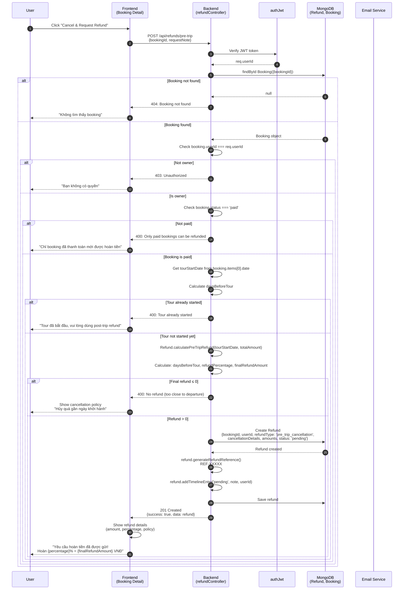
```mermaid
sequenceDiagram
    autonumber

    participant User
    participant Frontend as Frontend<br/>(Booking Detail)
    participant Backend as Backend<br/>(refundController)
    participant AuthMiddleware as authJwt
    participant DB as MongoDB<br/>(Refund, Booking)
    participant Email as Email Service

    User->>Frontend: Click "Cancel & Request Refund"
    Frontend->>Backend: POST /api/refunds/pre-trip<br/>{bookingId, requestNote}

    Backend->>AuthMiddleware: Verify JWT token
    AuthMiddleware-->>Backend: req.userId

    %% Validate Booking
    Backend->>DB: findById Booking({bookingId})
    alt Booking not found
        DB-->>Backend: null
        Backend-->>Frontend: 404: Booking not found
        Frontend-->>User: "Không tìm thấy booking"
    else Booking found
        DB-->>Backend: Booking object

        %% Check Ownership
        Backend->>Backend: Check booking.userId === req.userId
        alt Not owner
            Backend-->>Frontend: 403: Unauthorized
            Frontend-->>User: "Bạn không có quyền"
        else Is owner

            %% Check Status
            Backend->>Backend: Check booking.status === 'paid'
            alt Not paid
                Backend-->>Frontend: 400: Only paid bookings can be refunded
                Frontend-->>User: "Chỉ booking đã thanh toán mới được hoàn tiền"
            else Booking is paid

                %% Check Tour Start Date
                Backend->>Backend: Get tourStartDate from booking.items[0].date
                Backend->>Backend: Calculate daysBeforeTour

                alt Tour already started
                    Backend-->>Frontend: 400: Tour already started
                    Frontend-->>User: "Tour đã bắt đầu, vui lòng dùng post-trip refund"
                else Tour not started yet

                    %% Calculate Refund
                    Backend->>Backend: Refund.calculatePreTripRefund(tourStartDate, totalAmount)
                    Backend->>Backend: Calculate: daysBeforeTour, refundPercentage, finalRefundAmount

                    alt Final refund ≤ 0
                        Backend-->>Frontend: 400: No refund (too close to departure)
                        Frontend-->>User: Show cancellation policy<br/>"Hủy quá gần ngày khởi hành"
                    else Refund > 0

                        %% Create Refund
                        Backend->>DB: Create Refund<br/>{bookingId, userId, refundType: 'pre_trip_cancellation',<br/>cancellationDetails, amounts, status: 'pending'}
                        DB-->>Backend: Refund created

                        Backend->>Backend: refund.generateRefundReference()<br/>REF-XXXXX
                        Backend->>Backend: refund.addTimelineEntry('pending', note, userId)
                        Backend->>DB: Save refund

                        Backend-->>Frontend: 201 Created<br/>{success: true, data: refund}

                        Frontend->>Frontend: Show refund details<br/>(amount, percentage, policy)
                        Frontend-->>User: "Yêu cầu hoàn tiền đã được gửi!<br/>Hoàn {percentage}% = {finalRefundAmount} VNĐ"
                    end
                end
            end
        end
    end
```

#### 8.3.2. Post-Trip Issue Refund Flow

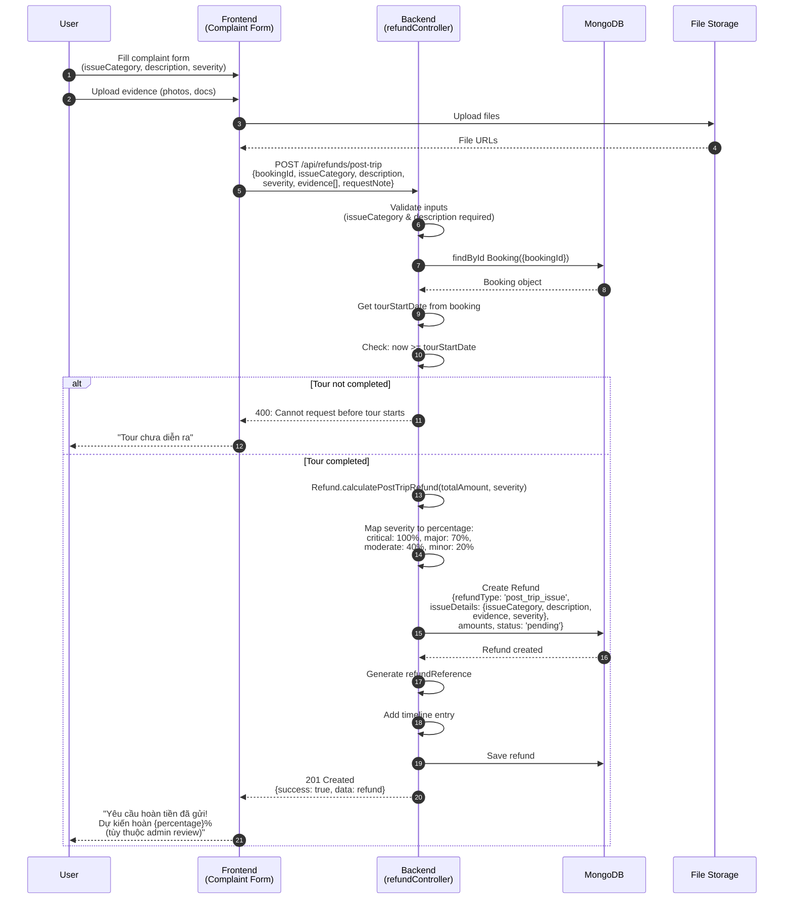
```mermaid
sequenceDiagram
    autonumber

    participant User
    participant Frontend as Frontend<br/>(Complaint Form)
    participant Backend as Backend<br/>(refundController)
    participant DB as MongoDB
    participant FileUpload as File Storage

    User->>Frontend: Fill complaint form<br/>(issueCategory, description, severity)
    User->>Frontend: Upload evidence (photos, docs)
    Frontend->>FileUpload: Upload files
    FileUpload-->>Frontend: File URLs

    Frontend->>Backend: POST /api/refunds/post-trip<br/>{bookingId, issueCategory, description,<br/>severity, evidence[], requestNote}

    Backend->>Backend: Validate inputs<br/>(issueCategory & description required)

    Backend->>DB: findById Booking({bookingId})
    DB-->>Backend: Booking object

    %% Check Tour Completion
    Backend->>Backend: Get tourStartDate from booking
    Backend->>Backend: Check: now >= tourStartDate
    alt Tour not completed
        Backend-->>Frontend: 400: Cannot request before tour starts
        Frontend-->>User: "Tour chưa diễn ra"
    else Tour completed

        %% Calculate Refund by Severity
        Backend->>Backend: Refund.calculatePostTripRefund(totalAmount, severity)
        Backend->>Backend: Map severity to percentage:<br/>critical: 100%, major: 70%,<br/>moderate: 40%, minor: 20%

        %% Create Refund
        Backend->>DB: Create Refund<br/>{refundType: 'post_trip_issue',<br/>issueDetails: {issueCategory, description,<br/>evidence, severity},<br/>amounts, status: 'pending'}
        DB-->>Backend: Refund created

        Backend->>Backend: Generate refundReference
        Backend->>Backend: Add timeline entry
        Backend->>DB: Save refund

        Backend-->>Frontend: 201 Created<br/>{success: true, data: refund}

        Frontend-->>User: "Yêu cầu hoàn tiền đã gửi!<br/>Dự kiến hoàn {percentage}%<br/>(tùy thuộc admin review)"
    end
```

#### 8.3.3. Admin Review & Approve Refund

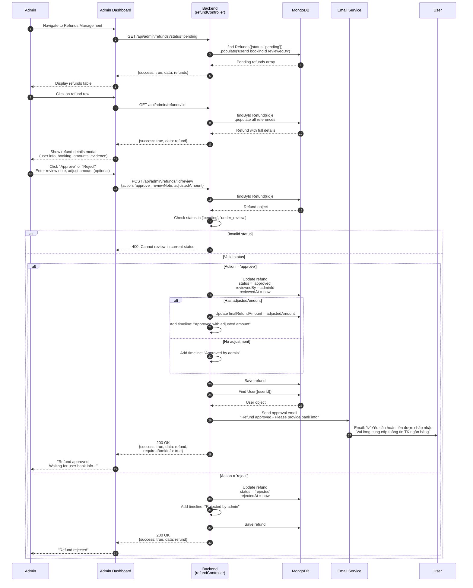
```mermaid
sequenceDiagram
    autonumber

    participant Admin
    participant Frontend as Admin Dashboard
    participant Backend as Backend<br/>(refundController)
    participant DB as MongoDB
    participant Email as Email Service
    participant User

    Admin->>Frontend: Navigate to Refunds Management
    Frontend->>Backend: GET /api/admin/refunds?status=pending
    Backend->>DB: find Refunds({status: 'pending'})<br/>.populate('userId bookingId reviewedBy')
    DB-->>Backend: Pending refunds array
    Backend-->>Frontend: {success: true, data: refunds}
    Frontend-->>Admin: Display refunds table

    Admin->>Frontend: Click on refund row
    Frontend->>Backend: GET /api/admin/refunds/:id
    Backend->>DB: findById Refund({id})<br/>.populate all references
    DB-->>Backend: Refund with full details
    Backend-->>Frontend: {success: true, data: refund}
    Frontend-->>Admin: Show refund details modal<br/>(user info, booking, amounts, evidence)

    %% Review Decision
    Admin->>Frontend: Click "Approve" or "Reject"<br/>Enter review note, adjust amount (optional)
    Frontend->>Backend: POST /api/admin/refunds/:id/review<br/>{action: 'approve', reviewNote, adjustedAmount}

    Backend->>DB: findById Refund({id})
    DB-->>Backend: Refund object

    %% Validate Status
    Backend->>Backend: Check status in ['pending', 'under_review']
    alt Invalid status
        Backend-->>Frontend: 400: Cannot review in current status
    else Valid status

        alt Action = 'approve'
            Backend->>DB: Update refund<br/>status = 'approved'<br/>reviewedBy = adminId<br/>reviewedAt = now

            alt Has adjustedAmount
                Backend->>DB: Update finalRefundAmount = adjustedAmount
                Backend->>Backend: Add timeline: "Approved with adjusted amount"
            else No adjustment
                Backend->>Backend: Add timeline: "Approved by admin"
            end

            Backend->>DB: Save refund

            %% Send Approval Email
            Backend->>DB: Find User({userId})
            DB-->>Backend: User object
            Backend->>Email: Send approval email<br/>"Refund approved - Please provide bank info"
            Email->>User: Email: "✅ Yêu cầu hoàn tiền được chấp nhận<br/>Vui lòng cung cấp thông tin TK ngân hàng"

            Backend-->>Frontend: 200 OK<br/>{success: true, data: refund,<br/>requiresBankInfo: true}
            Frontend-->>Admin: "Refund approved!<br/>Waiting for user bank info..."

        else Action = 'reject'
            Backend->>DB: Update refund<br/>status = 'rejected'<br/>rejectedAt = now
            Backend->>Backend: Add timeline: "Rejected by admin"
            Backend->>DB: Save refund

            Backend-->>Frontend: 200 OK<br/>{success: true, data: refund}
            Frontend-->>Admin: "Refund rejected"
        end
    end
```

#### 8.3.4. User Provides Bank Info & Processing

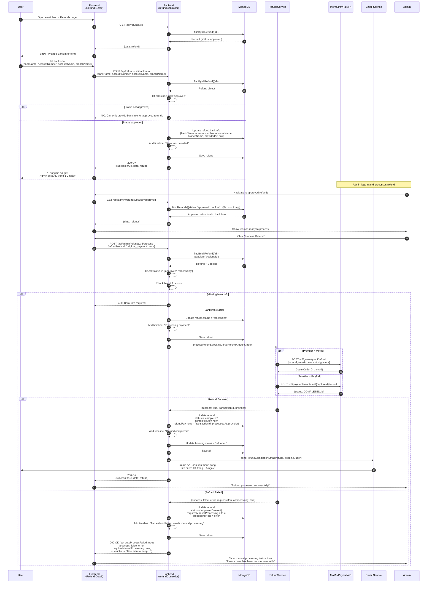
```mermaid
sequenceDiagram
    autonumber

    participant User
    participant Frontend as Frontend<br/>(Refund Detail)
    participant Backend as Backend<br/>(refundController)
    participant DB as MongoDB
    participant RefundService as RefundService
    participant MoMo as MoMo/PayPal API
    participant Email as Email Service
    participant Admin

    %% User receives email and provides bank info
    User->>Frontend: Open email link → Refunds page
    Frontend->>Backend: GET /api/refunds/:id
    Backend->>DB: findById Refund({id})
    DB-->>Backend: Refund (status: approved)
    Backend-->>Frontend: {data: refund}
    Frontend-->>User: Show "Provide Bank Info" form

    User->>Frontend: Fill bank info<br/>(bankName, accountNumber, accountName, branchName)
    Frontend->>Backend: POST /api/refunds/:id/bank-info<br/>{bankName, accountNumber, accountName, branchName}

    Backend->>DB: findById Refund({id})
    DB-->>Backend: Refund object

    %% Validate
    Backend->>Backend: Check status === 'approved'
    alt Status not approved
        Backend-->>Frontend: 400: Can only provide bank info for approved refunds
    else Status approved

        Backend->>DB: Update refund.bankInfo<br/>{bankName, accountNumber, accountName,<br/>branchName, providedAt: now}
        Backend->>Backend: Add timeline: "Bank info provided"
        Backend->>DB: Save refund

        Backend-->>Frontend: 200 OK<br/>{success: true, data: refund}
        Frontend-->>User: "Thông tin đã gửi!<br/>Admin sẽ xử lý trong 1-2 ngày"
    end

    %% Admin processes refund
    Note over Admin,MoMo: Admin logs in and processes refund

    Admin->>Frontend: Navigate to approved refunds
    Frontend->>Backend: GET /api/admin/refunds?status=approved
    Backend->>DB: find Refunds({status: 'approved', bankInfo: {$exists: true}})
    DB-->>Backend: Approved refunds with bank info
    Backend-->>Frontend: {data: refunds}
    Frontend-->>Admin: Show refunds ready to process

    Admin->>Frontend: Click "Process Refund"
    Frontend->>Backend: POST /api/admin/refunds/:id/process<br/>{refundMethod: 'original_payment', note}

    Backend->>DB: findById Refund({id})<br/>.populate('bookingId')
    DB-->>Backend: Refund + Booking

    %% Validate
    Backend->>Backend: Check status in ['approved', 'processing']
    Backend->>Backend: Check bankInfo exists
    alt Missing bank info
        Backend-->>Frontend: 400: Bank info required
    else Bank info exists

        Backend->>DB: Update refund.status = 'processing'
        Backend->>Backend: Add timeline: "Processing payment"
        Backend->>DB: Save refund

        %% Call RefundService
        Backend->>RefundService: processRefund(booking, finalRefundAmount, note)

        alt Provider = MoMo
            RefundService->>MoMo: POST /v2/gateway/api/refund<br/>{orderId, transId, amount, signature}
            MoMo-->>RefundService: {resultCode: 0, transId}
        else Provider = PayPal
            RefundService->>MoMo: POST /v2/payments/captures/{captureId}/refund
            MoMo-->>RefundService: {status: COMPLETED, id}
        end

        alt Refund Success
            RefundService-->>Backend: {success: true, transactionId, provider}

            Backend->>DB: Update refund<br/>status = 'completed'<br/>completedAt = now<br/>refundPayment = {transactionId, processedAt, provider}
            Backend->>Backend: Add timeline: "Refund completed"
            Backend->>DB: Update booking.status = 'refunded'
            Backend->>DB: Save all

            Backend->>Email: sendRefundCompletionEmail(refund, booking, user)
            Email->>User: Email: "✅ Hoàn tiền thành công!<br/>Tiền sẽ về TK trong 3-5 ngày"

            Backend-->>Frontend: 200 OK<br/>{success: true, data: refund}
            Frontend-->>Admin: "Refund processed successfully!"

        else Refund Failed
            RefundService-->>Backend: {success: false, error, requiresManualProcessing: true}

            Backend->>DB: Update refund<br/>status = 'approved' (revert)<br/>requiresManualProcessing = true<br/>processingNote = error
            Backend->>Backend: Add timeline: "Auto-refund failed, needs manual processing"
            Backend->>DB: Save refund

            Backend-->>Frontend: 200 OK (but autoProcessFailed: true)<br/>{success: false, error,<br/>requiresManualProcessing: true,<br/>instructions: "Use manual script..."}
            Frontend-->>Admin: Show manual processing instructions<br/>"Please complete bank transfer manually"
        end
    end
```

#### 8.3.5. Manual Payment Processing (Sandbox)

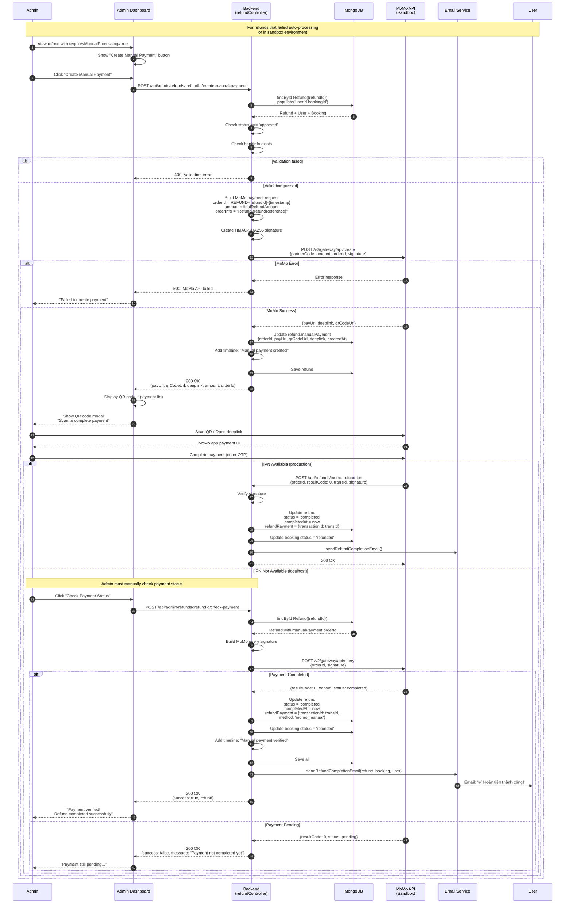
```mermaid
sequenceDiagram
    autonumber

    participant Admin
    participant Frontend as Admin Dashboard
    participant Backend as Backend<br/>(refundController)
    participant DB as MongoDB
    participant MoMo as MoMo API<br/>(Sandbox)
    participant Email as Email Service
    participant User

    Note over Admin,User: For refunds that failed auto-processing<br/>or in sandbox environment

    Admin->>Frontend: View refund with requiresManualProcessing=true
    Frontend->>Frontend: Show "Create Manual Payment" button

    Admin->>Frontend: Click "Create Manual Payment"
    Frontend->>Backend: POST /api/admin/refunds/:refundId/create-manual-payment

    Backend->>DB: findById Refund({refundId})<br/>.populate('userId bookingId')
    DB-->>Backend: Refund + User + Booking

    %% Validate
    Backend->>Backend: Check status === 'approved'
    Backend->>Backend: Check bankInfo exists
    alt Validation failed
        Backend-->>Frontend: 400: Validation error
    else Validation passed

        %% Create MoMo Payment Request
        Backend->>Backend: Build MoMo payment request<br/>orderId = REFUND-{refundId}-{timestamp}<br/>amount = finalRefundAmount<br/>orderInfo = "Refund {refundReference}"
        Backend->>Backend: Create HMAC-SHA256 signature
        Backend->>MoMo: POST /v2/gateway/api/create<br/>{partnerCode, amount, orderId, signature}

        alt MoMo Error
            MoMo-->>Backend: Error response
            Backend-->>Frontend: 500: MoMo API failed
            Frontend-->>Admin: "Failed to create payment"
        else MoMo Success
            MoMo-->>Backend: {payUrl, deeplink, qrCodeUrl}

            Backend->>DB: Update refund.manualPayment<br/>{orderId, payUrl, qrCodeUrl, deeplink, createdAt}
            Backend->>Backend: Add timeline: "Manual payment created"
            Backend->>DB: Save refund

            Backend-->>Frontend: 200 OK<br/>{payUrl, qrCodeUrl, deeplink, amount, orderId}

            Frontend->>Frontend: Display QR code + payment link
            Frontend-->>Admin: Show QR code modal<br/>"Scan to complete payment"

            %% Admin completes payment
            Admin->>MoMo: Scan QR / Open deeplink
            MoMo-->>Admin: MoMo app payment UI
            Admin->>MoMo: Complete payment (enter OTP)

            alt IPN Available (production)
                MoMo->>Backend: POST /api/refunds/momo-refund-ipn<br/>{orderId, resultCode: 0, transId, signature}
                Backend->>Backend: Verify signature
                Backend->>DB: Update refund<br/>status = 'completed'<br/>completedAt = now<br/>refundPayment = {transactionId: transId}
                Backend->>DB: Update booking.status = 'refunded'
                Backend->>Email: sendRefundCompletionEmail()
                Backend-->>MoMo: 200 OK
            else IPN Not Available (localhost)
                Note over Admin,Backend: Admin must manually check payment status

                Admin->>Frontend: Click "Check Payment Status"
                Frontend->>Backend: POST /api/admin/refunds/:refundId/check-payment

                Backend->>DB: findById Refund({refundId})
                DB-->>Backend: Refund with manualPayment.orderId

                Backend->>Backend: Build MoMo query signature
                Backend->>MoMo: POST /v2/gateway/api/query<br/>{orderId, signature}

                alt Payment Completed
                    MoMo-->>Backend: {resultCode: 0, transId, status: completed}

                    Backend->>DB: Update refund<br/>status = 'completed'<br/>completedAt = now<br/>refundPayment = {transactionId: transId,<br/>method: 'momo_manual'}
                    Backend->>DB: Update booking.status = 'refunded'
                    Backend->>Backend: Add timeline: "Manual payment verified"
                    Backend->>DB: Save all

                    Backend->>Email: sendRefundCompletionEmail(refund, booking, user)
                    Email->>User: Email: "✅ Hoàn tiền thành công!"

                    Backend-->>Frontend: 200 OK<br/>{success: true, refund}
                    Frontend-->>Admin: "Payment verified!<br/>Refund completed successfully"

                else Payment Pending
                    MoMo-->>Backend: {resultCode: 0, status: pending}
                    Backend-->>Frontend: 200 OK<br/>{success: false, message: "Payment not completed yet"}
                    Frontend-->>Admin: "Payment still pending..."
                end
            end
        end
    end
```

---

### 8.4. Database Queries

| #   | Query Name                         | MongoDB Query                                                                                                                                                                                                                                                                                                                                                                                                                                                                                                                                                                                                                                                                                                                                                                                                                                                                                                                                                                                                                                                                                                                                                                                                                                                                                                                                                                                 | Returns                                                                                                    |
| --- | ---------------------------------- | --------------------------------------------------------------------------------------------------------------------------------------------------------------------------------------------------------------------------------------------------------------------------------------------------------------------------------------------------------------------------------------------------------------------------------------------------------------------------------------------------------------------------------------------------------------------------------------------------------------------------------------------------------------------------------------------------------------------------------------------------------------------------------------------------------------------------------------------------------------------------------------------------------------------------------------------------------------------------------------------------------------------------------------------------------------------------------------------------------------------------------------------------------------------------------------------------------------------------------------------------------------------------------------------------------------------------------------------------------------------------------------------- | ---------------------------------------------------------------------------------------------------------- |
| 1   | Create Pre-Trip Refund             | `const refundCalc = Refund.calculatePreTripRefund(tourStartDate, originalAmount);`<br/>`const refund = new Refund({`<br/>`  bookingId, userId, orderRef,`<br/>`  refundType: "pre_trip_cancellation",`<br/>`  originalAmount, refundableAmount: refundCalc.refundableAmount,`<br/>`  refundPercentage: refundCalc.refundPercentage,`<br/>`  processingFee: refundCalc.processingFee,`<br/>`  finalRefundAmount: refundCalc.finalRefundAmount,`<br/>`  cancellationDetails: { tourStartDate, cancellationDate: new Date(),`<br/>`    daysBeforeTour: refundCalc.daysBeforeTour, cancellationPolicy: refundCalc.policy },`<br/>`  requestedBy: userId, requestNote, currency: "VND",`<br/>`  originalPayment: { provider, orderId, transactionId }`<br/>`});`<br/>`refund.generateRefundReference();`<br/>`refund.addTimelineEntry("pending", "Refund request created", userId);`<br/>`await refund.save();`                                                                                                                                                                                                                                                                                                                                                                                                                                                                                    | Refund document với status `pending`                                                                       |
| 2   | Get User Refunds with Pagination   | `const query = { userId };`<br/>`if (status) query.status = status;`<br/>`if (type) query.refundType = type;`<br/>`const skip = (page - 1) * limit;`<br/>`const refunds = await Refund.find(query)`<br/>`  .populate("bookingId", "orderRef items totalAmount status payment.orderId")`<br/>`  .sort({ createdAt: -1 })`<br/>`  .skip(skip)`<br/>`  .limit(parseInt(limit));`<br/>`const total = await Refund.countDocuments(query);`                                                                                                                                                                                                                                                                                                                                                                                                                                                                                                                                                                                                                                                                                                                                                                                                                                                                                                                                                         | Array of Refunds với pagination (refunds[], total, page, limit)                                            |
| 3   | Admin Get All Refunds with Filters | `const query = {};`<br/>`if (status) query.status = status;`<br/>`if (type) query.refundType = type;`<br/>`if (startDate \|\| endDate) {`<br/>`  query.createdAt = {};`<br/>`  if (startDate) query.createdAt.$gte = new Date(startDate);`<br/>`  if (endDate) query.createdAt.$lte = new Date(endDate);`<br/>`}`<br/>`if (search) query.$or = [{ refundReference: { $regex: search, $options: "i" } }];`<br/>`const refunds = await Refund.find(query)`<br/>`  .populate("userId", "name email phone")`<br/>`  .populate("bookingId", "orderRef items totalAmount payment.orderId")`<br/>`  .populate("reviewedBy", "fullName")`<br/>`  .sort({ createdAt: -1 })`<br/>`  .skip((page - 1) * limit)`<br/>`  .limit(parseInt(limit));`                                                                                                                                                                                                                                                                                                                                                                                                                                                                                                                                                                                                                                                         | Array of Refunds với full user/booking info                                                                |
| 4   | Get Refund Statistics              | `const dateFilter = {};`<br/>`if (startDate \|\| endDate) {`<br/>`  dateFilter.createdAt = {};`<br/>`  if (startDate) dateFilter.createdAt.$gte = new Date(startDate);`<br/>`  if (endDate) dateFilter.createdAt.$lte = new Date(endDate);`<br/>`}`<br/>`const stats = await Refund.aggregate([`<br/>`  { $match: dateFilter },`<br/>`  { $group: {`<br/>`      _id: null,`<br/>`      totalRefunds: { $sum: 1 },`<br/>`      totalAmount: { $sum: "$finalRefundAmount" },`<br/>`      approvedAmount: { $sum: { $cond: [{ $in: ["$status", ["approved", "processing", "completed"]] }, "$finalRefundAmount", 0] }},`<br/>`      avgRefundAmount: { $avg: "$finalRefundAmount" },`<br/>`      preTripCancellations: { $sum: { $cond: [{ $eq: ["$refundType", "pre_trip_cancellation"] }, 1, 0] }},`<br/>`      postTripIssues: { $sum: { $cond: [{ $eq: ["$refundType", "post_trip_issue"] }, 1, 0] }},`<br/>`      pendingCount: { $sum: { $cond: [{ $eq: ["$status", "pending"] }, 1, 0] }},`<br/>`      approvedCount: { $sum: { $cond: [{ $eq: ["$status", "approved"] }, 1, 0] }},`<br/>`      processingCount: { $sum: { $cond: [{ $eq: ["$status", "processing"] }, 1, 0] }},`<br/>`      completedCount: { $sum: { $cond: [{ $eq: ["$status", "completed"] }, 1, 0] }},`<br/>`      rejectedCount: { $sum: { $cond: [{ $eq: ["$status", "rejected"] }, 1, 0] }}`<br/>`  }}`<br/>`]);` | Object với statistics: {totalRefunds, totalAmount, approvedAmount, avgRefundAmount, counts by type/status} |
| 5   | Auto-Expire Pending Refunds        | `const sevenDaysAgo = new Date();`<br/>`sevenDaysAgo.setDate(sevenDaysAgo.getDate() - 7);`<br/>`const expiredRefunds = await Refund.find({`<br/>`  status: "pending",`<br/>`  createdAt: { $lt: sevenDaysAgo }`<br/>`});`<br/>`for (const refund of expiredRefunds) {`<br/>`  refund.status = "rejected";`<br/>`  refund.rejectedAt = new Date();`<br/>`  refund.reviewNote = "Yêu cầu hoàn tiền đã hết hạn sau 7 ngày chờ xử lý";`<br/>`  refund.addTimelineEntry("rejected", "Auto-rejected: Request expired after 7 days", null);`<br/>`  await refund.save();`<br/>`}`                                                                                                                                                                                                                                                                                                                                                                                                                                                                                                                                                                                                                                                                                                                                                                                                                    | Updated refunds (status changed to `rejected`)                                                             |
| 6   | Find Refunds by Booking            | `const refunds = await Refund.findByBookingId(bookingId)`<br/>`  .populate("requestedBy", "fullName email")`<br/>`  .populate("reviewedBy", "fullName")`<br/>`  .populate("timeline.updatedBy", "fullName");`                                                                                                                                                                                                                                                                                                                                                                                                                                                                                                                                                                                                                                                                                                                                                                                                                                                                                                                                                                                                                                                                                                                                                                                 | Array of Refunds for the booking với full user info                                                        |
| 7   | Update Refund to Completed         | `refund.status = "completed";`<br/>`refund.completedAt = new Date();`<br/>`refund.refundPayment = {`<br/>`  transactionId: result.transactionId,`<br/>`  processedAt: new Date(),`<br/>`  provider: result.provider,`<br/>`  refundId: result.refundId`<br/>`};`<br/>`refund.addTimelineEntry("completed", `Refund processed via ${result.provider}. TxID: ${result.transactionId}`, adminId);`<br/>`await refund.save();`<br/>`const booking = await Booking.findById(refund.bookingId);`<br/>`booking.status = "refunded";`<br/>`booking.refundedAt = new Date();`<br/>`await booking.save();`                                                                                                                                                                                                                                                                                                                                                                                                                                                                                                                                                                                                                                                                                                                                                                                              | Updated Refund (status `completed`) + Updated Booking (status `refunded`)                                  |

---

### 8.5. Key Technical Features

#### 8.5.1. Refund Calculation Logic

**Pre-Trip Cancellation Policy** (Tiered by days before tour):

```javascript
function calculatePreTripRefund(tourStartDate, originalAmount) {
  const now = new Date();
  const tourDate = new Date(tourStartDate);
  const daysBeforeTour = Math.ceil((tourDate - now) / (1000 * 60 * 60 * 24));

  let refundPercentage = 0;
  let policy = "";

  if (daysBeforeTour >= 30) {
    refundPercentage = 90;
    policy = "30+ days: 90% refund";
  } else if (daysBeforeTour >= 14) {
    refundPercentage = 70;
    policy = "14-29 days: 70% refund";
  } else if (daysBeforeTour >= 7) {
    refundPercentage = 50;
    policy = "7-13 days: 50% refund";
  } else if (daysBeforeTour >= 3) {
    refundPercentage = 25;
    policy = "3-6 days: 25% refund";
  } else if (daysBeforeTour >= 1) {
    refundPercentage = 10;
    policy = "1-2 days: 10% refund";
  } else {
    refundPercentage = 0;
    policy = "Less than 1 day: No refund";
  }

  const refundableAmount = Math.round(
    originalAmount * (refundPercentage / 100)
  );
  const processingFee = Math.round(refundableAmount * 0.02); // 2% fee
  const finalRefundAmount = refundableAmount - processingFee;

  return {
    daysBeforeTour,
    refundPercentage,
    policy,
    refundableAmount,
    processingFee,
    finalRefundAmount,
  };
}
```

**Post-Trip Issue Refund** (Tiered by severity):

```javascript
function calculatePostTripRefund(originalAmount, severity = "moderate") {
  let refundPercentage = 0;

  switch (severity) {
    case "critical":
      refundPercentage = 100;
      break; // Full refund
    case "major":
      refundPercentage = 70;
      break;
    case "moderate":
      refundPercentage = 40;
      break;
    case "minor":
      refundPercentage = 20;
      break;
    default:
      refundPercentage = 30;
  }

  const refundableAmount = Math.round(
    originalAmount * (refundPercentage / 100)
  );
  const processingFee = 0; // No fee for post-trip
  const finalRefundAmount = refundableAmount - processingFee;

  return {
    refundPercentage,
    refundableAmount,
    processingFee,
    finalRefundAmount,
  };
}
```

#### 8.5.2. Payment Gateway Integration

**MoMo Refund API**:

- Endpoint: `POST /v2/gateway/api/refund`
- Required: `orderId`, `transId` (from original payment)
- Signature: `HMAC-SHA256(rawSignature, secretKey)`
- Returns: `{resultCode, transId, message}`

**PayPal Refund API**:

- Endpoint: `POST /v2/payments/captures/{captureId}/refund`
- Auth: OAuth2 Bearer token
- Required: `captureId` (from original payment)
- Returns: `{id, status, amount}`

#### 8.5.3. Email Notifications

1. **Refund Approved Email** (After admin approval)

   - Subject: "✅ Refund Approved - Cần Cung Cấp Thông Tin Ngân Hàng"
   - Content: Refund amount, booking reference, CTA button to provide bank info
   - Sent to: User email

2. **Refund Completed Email** (After processing)
   - Subject: "✅ Hoàn Tiền Thành Công"
   - Content: Final refund amount, transaction ID, bank account info, estimated arrival time (3-5 days)
   - Sent to: User email

#### 8.5.4. Background Jobs (Cron)

**Auto-Expire Pending Refunds**:

- Schedule: Every minute (via node-cron)
- Logic: Find refunds with `status='pending'` AND `createdAt < 7 days ago`
- Action: Set `status='rejected'`, add timeline entry
- Purpose: Prevent stale refund requests

#### 8.5.5. Security & Validation

- **Ownership Check**: User can only access their own refunds
- **Status Validation**: Strict state machine (pending → under_review → approved → processing → completed)
- **Signature Verification**: All MoMo IPN callbacks verified with HMAC-SHA256
- **Idempotency**: Prevent duplicate refund requests for same booking
- **Bank Info Encryption**: Sensitive data stored with field-level encryption (future enhancement)

---

### 8.6. Use Cases Summary

**User Flows**:

1. **Pre-Trip Cancellation**: User cancels booking → Request refund → System calculates based on days before tour → Admin reviews → User provides bank info → Admin processes → Money refunded
2. **Post-Trip Issue**: User completes tour → Encounters issue → Submit complaint with evidence → Admin reviews → User provides bank info → Admin processes → Money refunded

**Admin Flows**:

1. **Review Refunds**: View pending requests → Review details & evidence → Approve/Reject → Send notification
2. **Process Approved Refunds**: View approved refunds → Check bank info → Process via payment gateway → Mark completed → Send email
3. **Manual Payment (Sandbox)**: Create MoMo payment link → Scan QR → Complete payment → Verify status → Mark completed

**Error Recovery**:

1. **Auto-Refund Failed**: Gateway timeout/error → Mark for manual processing → Admin completes via bank transfer → Mark completed
2. **User Never Provides Bank Info**: Refund stays in approved state → Reminder emails (future) → Manual follow-up

---

**📅 Document Version:** 3.0  
**Last Updated:** November 14, 2025  
**Section Added:** Refund System (Class Diagram, Specifications, Sequence Diagrams, Database Queries)  
**Generated by:** GitHub Copilot

---

## 9. Admin User Management (Quản lý người dùng)

### 8.1. Get All Users with Filters

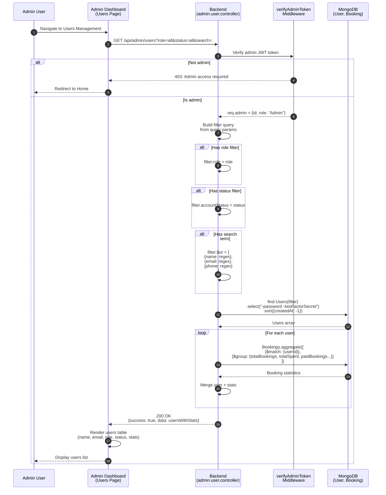
```mermaid
sequenceDiagram
    autonumber

    participant Admin as Admin User
    participant Frontend as Admin Dashboard<br/>(Users Page)
    participant Backend as Backend<br/>(admin.user.controller)
    participant AdminAuth as verifyAdminToken<br/>Middleware
    participant DB as MongoDB<br/>(User, Booking)

    Admin->>Frontend: Navigate to Users Management
    Frontend->>Backend: GET /api/admin/users?role=all&status=all&search=

    Backend->>AdminAuth: Verify admin JWT token
    alt Not admin
        AdminAuth-->>Frontend: 403: Admin access required
        Frontend-->>Admin: Redirect to Home
    else Is admin
        AdminAuth-->>Backend: req.admin = {id, role: "Admin"}

        Backend->>Backend: Build filter query<br/>from query params

        alt Has role filter
            Backend->>Backend: filter.role = role
        end

        alt Has status filter
            Backend->>Backend: filter.accountStatus = status
        end

        alt Has search term
            Backend->>Backend: filter.$or = [<br/>  {name: regex},<br/>  {email: regex},<br/>  {phone: regex}<br/>]
        end

        Backend->>DB: find Users(filter)<br/>.select("-password -twoFactorSecret")<br/>.sort({createdAt: -1})
        DB-->>Backend: Users array

        %% Get Stats for Each User
        loop For each user
            Backend->>DB: Bookings.aggregate([<br/>  {$match: {userId}},<br/>  {$group: {totalBookings, totalSpent, paidBookings...}}<br/>])
            DB-->>Backend: Booking statistics
            Backend->>Backend: Merge user + stats
        end

        Backend-->>Frontend: 200 OK<br/>{success: true, data: usersWithStats}
        Frontend->>Frontend: Render users table<br/>(name, email, role, status, stats)
        Frontend-->>Admin: Display users list
    end
```

### 8.2. Ban/Unban User

```mermaid
sequenceDiagram
    autonumber

    participant Admin
    participant Frontend as Admin Dashboard
    participant Backend as Backend<br/>(admin.user.controller)
    participant AdminAuth as verifyAdminToken
    participant DB as MongoDB
    participant User as Target User<br/>(Active Session)

    Admin->>Frontend: Click "Ban User" button<br/>Enter ban reason
    Frontend->>Backend: PUT /api/admin/users/:id/status<br/>{status: "banned", reason: "Vi phạm chính sách"}

    Backend->>AdminAuth: Verify admin token
    AdminAuth-->>Backend: req.userId (admin ID)

    Backend->>DB: findById(userId)
    alt User not found
        DB-->>Backend: null
        Backend-->>Frontend: 404: User not found
        Frontend-->>Admin: "Không tìm thấy user"
    else User found
        DB-->>Backend: User object

        Backend->>Backend: prevStatus = user.accountStatus
        Backend->>DB: Update user<br/>accountStatus = "banned"<br/>statusReason = reason<br/>statusUpdatedBy = adminId

        alt Banning user (prevStatus != "banned")
            Backend->>DB: Append to user.lockHistory<br/>{reason, lockedAt, lockedBy: adminId}
        else Unbanning user (status = "active")
            Backend->>DB: Update latest lockHistory entry<br/>{unlockedAt, unlockedBy: adminId}
        end

        DB-->>Backend: User updated
        Backend-->>Frontend: 200 OK<br/>{success: true, message, data: user}

        Frontend->>Frontend: Update users table UI
        Frontend-->>Admin: "User banned successfully"

        %% Impact on User Session
        Note over User: User's next API call
        User->>Backend: GET /api/bookings (any protected route)
        Backend->>AdminAuth: authJwt middleware
        AdminAuth->>DB: Check user.accountStatus
        alt User is banned
            DB-->>AdminAuth: accountStatus = "banned"
            AdminAuth-->>User: 403: Tài khoản bị khóa<br/>{reason: statusReason}
            User->>User: Show ban screen<br/>Display ban reason
        end
    end
```

### 8.3. Get User Statistics

```mermaid
sequenceDiagram
    autonumber

    participant Admin
    participant Frontend as Admin Dashboard
    participant Backend as Backend<br/>(admin.user.controller)
    participant DB as MongoDB

    Admin->>Frontend: View Dashboard Stats
    Frontend->>Backend: GET /api/admin/users/stats

    Backend->>DB: Count total users
    DB-->>Backend: totalUsers

    Backend->>DB: Count by role<br/>(Traveler, TourGuide, TravelAgency)
    DB-->>Backend: travelers, guides, agencies

    Backend->>DB: Count active users<br/>(lastLogin >= 30 days ago)
    DB-->>Backend: activeUsers

    Backend->>DB: Count new users this month<br/>(createdAt >= firstDayOfMonth)
    DB-->>Backend: newUsersThisMonth

    Backend-->>Frontend: 200 OK<br/>{success: true, data: {<br/>  totalUsers, travelers, guides,<br/>  agencies, activeUsers, newUsersThisMonth<br/>}}

    Frontend->>Frontend: Render stat cards<br/>(charts, numbers)
    Frontend-->>Admin: Display dashboard
```

### 8.4. Get User Details with Bookings

```mermaid
sequenceDiagram
    autonumber

    participant Admin
    participant Frontend as Admin Dashboard
    participant Backend as Backend
    participant DB as MongoDB

    Admin->>Frontend: Click on user row
    Frontend->>Backend: GET /api/admin/users/:id

    Backend->>DB: findById(userId)<br/>.select("-password -twoFactorSecret")
    alt User not found
        DB-->>Backend: null
        Backend-->>Frontend: 404: User not found
    else User found
        DB-->>Backend: User object

        Backend->>DB: Bookings.aggregate([<br/>  {$match: {userId}},<br/>  {$group: {totalBookings, totalSpent,<br/>    paidBookings, pendingBookings, cancelledBookings}}<br/>])
        DB-->>Backend: Booking statistics

        Backend-->>Frontend: 200 OK<br/>{success: true, data: {user, stats}}

        Frontend->>Backend: GET /api/admin/users/:id/bookings
        Backend->>DB: find Bookings({userId})<br/>.populate("items.tourId")<br/>.sort({createdAt: -1})
        DB-->>Backend: Bookings array
        Backend-->>Frontend: {success: true, data: bookings}

        Frontend->>Frontend: Render user detail modal<br/>(profile, stats, bookings list)
        Frontend-->>Admin: Show detailed user info
    end
```

### 8.5. Tour Guide Management

```mermaid
sequenceDiagram
    autonumber

    participant Admin
    participant Frontend as Admin Dashboard
    participant Backend as Backend
    participant DB as MongoDB<br/>(TravelAgency)

    Admin->>Frontend: Navigate to Tour Guides
    Frontend->>Backend: GET /api/admin/users/guides?status=all&search=

    Backend->>DB: find TravelAgency({})<br/>.select("name employees")
    DB-->>Backend: Agencies array

    Backend->>Backend: Extract all employees<br/>from all agencies
    loop For each agency
        Backend->>Backend: Map employees to guides<br/>{name, email, agencyName,<br/>rating, experienceYears, stats}
    end

    Backend->>Backend: Apply search filter<br/>(name, email, agencyName)
    Backend->>Backend: Apply status filter<br/>(active, inactive, suspended)

    Backend-->>Frontend: 200 OK<br/>{success: true, data: allGuides, count}
    Frontend-->>Admin: Display guides table

    %% Update Guide Status
    Admin->>Frontend: Click "Suspend Guide"
    Frontend->>Backend: PUT /api/admin/users/guides/:id/status<br/>{status: "suspended", reason}

    Backend->>DB: findOne TravelAgency<br/>({"employees.employeeId": guideId})
    DB-->>Backend: Agency with guide

    Backend->>DB: Update agency.employees[index]<br/>.status = "suspended"<br/>.statusReason = reason
    DB-->>Backend: Updated

    Backend-->>Frontend: 200 OK<br/>{success: true, message, data}
    Frontend-->>Admin: "Guide suspended successfully"
```

**Key Points:**

- **Admin Authentication**: Tất cả routes require admin role (verifyAdminToken middleware)
- **Filter & Search**: Support filter by role, status và search by name/email/phone
- **Booking Statistics**: Tự động tính stats cho mỗi user (totalBookings, totalSpent, etc.)
- **Ban System**:
  - Lock history tracking (lockedAt, lockedBy, unlockedAt, unlockedBy)
  - Real-time impact: User bị kick out ngay lập tức via authJwt middleware
  - Status reason hiển thị cho user
- **Tour Guide Management**:
  - Guides được lưu trong TravelAgency.employees
  - Admin có thể suspend/activate guides
  - Track stats: tours, revenue, ratings
- **Soft Delete**: Delete user via findByIdAndDelete (có thể đổi sang soft delete)
- **Security**: Không expose password và twoFactorSecret trong API responses

---

## 📊 Summary Table

| Feature                | Endpoint                             | Method | Auth Required | Transaction | Key Logic                                                    |
| ---------------------- | ------------------------------------ | ------ | ------------- | ----------- | ------------------------------------------------------------ |
| Register               | `/api/auth/register`                 | POST   | ❌            | ❌          | Zod validation, Uniqueness check, Hash password              |
| Login                  | `/api/auth/login`                    | POST   | ❌            | ❌          | Password verify, Ban check, Dual tokens                      |
| Logout                 | `/api/auth/logout`                   | POST   | ❌            | ❌          | Clear cookie, Frontend state cleanup                         |
| Change Password        | `/api/auth/change-password`          | POST   | ✅            | ❌          | OAuth check, Current password verify, Email notify           |
| Add to Cart            | `/api/cart`                          | POST   | ✅            | ✅          | Capacity guard, Price snapshot, Upsert                       |
| Add Wishlist           | `/api/wishlist`                      | POST   | ✅            | ❌          | Tour exists check, Unique constraint                         |
| Toggle Wishlist        | `/api/wishlist/toggle`               | POST   | ✅            | ❌          | Smart add/remove in 1 call                                   |
| Get Wishlist           | `/api/wishlist`                      | GET    | ✅            | ❌          | Populate Tour & Location, Filter deleted                     |
| Check Many             | `/api/wishlist/check-many`           | GET    | ✅            | ❌          | Bulk check for tour list rendering                           |
| MoMo Payment           | `/api/payments/momo`                 | POST   | ✅            | ❌          | Signature verify, Seat holding, IPN callback, Voucher usage  |
| Retry Payment          | `/api/payments/momo` (retry mode)    | POST   | ✅            | ❌          | Re-check seats, Re-validate voucher, Update original booking |
| PayPal Payment         | `/api/paypal/create-order`           | POST   | ✅            | ❌          | VND→USD conversion, OAuth token, Seat holding                |
| PayPal Capture         | `/api/paypal/capture-order`          | POST   | ✅            | ✅          | Capture payment, Create booking, Clear cart, Confirm seats   |
| Admin Get Users        | `/api/admin/users`                   | GET    | ✅ (Admin)    | ❌          | Filter by role/status, Search, Aggregate booking stats       |
| Admin Ban User         | `/api/admin/users/:id/status`        | PUT    | ✅ (Admin)    | ❌          | Update status, Lock history, Real-time session invalidation  |
| Admin Get Stats        | `/api/admin/users/stats`             | GET    | ✅ (Admin)    | ❌          | Count users by role, active users, new users this month      |
| Admin Get User Details | `/api/admin/users/:id`               | GET    | ✅ (Admin)    | ❌          | User profile + booking statistics                            |
| Admin Get Guides       | `/api/admin/users/guides`            | GET    | ✅ (Admin)    | ❌          | Extract from TravelAgency.employees, Filter & search         |
| Admin Update Guide     | `/api/admin/users/guides/:id/status` | PUT    | ✅ (Admin)    | ❌          | Update guide status in TravelAgency.employees array          |

---

## 🔧 Technical Notes

### Security Features

- **Password**: bcrypt with 10 salt rounds
- **JWT**: Access (15min) + Refresh (30d) dual token system
- **Cookie**: HttpOnly, Secure (prod), SameSite protection
- **Ban check**: Real-time trong middleware + login
- **Payment Security**:
  - HMAC-SHA256 signature verification (MoMo)
  - OAuth2 client credentials (PayPal)
  - Server-side amount recalculation (không tin FE)
  - IPN signature verification
- **Admin Auth**: Role-based access control (RBAC) với verifyAdminToken middleware

### Performance Optimizations

- **Cart**: MongoDB transaction cho atomicity
- **Wishlist**: Bulk check API cho list pages
- **Populate**: Cascade populate (1 query thay vì N+1)
- **Index**: Unique indexes trên (userId, tourId), (cartId, tourId, date)
- **Payment**:
  - Seat holding với timeout (1 min auto-release)
  - Idempotent booking creation (check duplicate trước khi tạo)
  - Async IPN processing (không block user flow)
- **Admin**:
  - Aggregate pipeline cho booking statistics
  - Pagination support (future enhancement)

### Error Handling

- **Validation**: Zod schema với custom error messages
- **Conflict**: 409 cho capacity/uniqueness violations
- **Auth**: 401 (invalid token), 403 (banned/forbidden)
- **Not Found**: 404 với clear messages
- **Payment Errors**:
  - 502: External API failures (MoMo/PayPal)
  - 422: Payment capture failures
  - Auto retry logic cho IPN callbacks
  - Failed payment handling: Release seats + Restore cart

### Payment Flow Details

#### MoMo Integration

- **Environment**: Sandbox với test limit 10M VNĐ
- **Signature**: HMAC-SHA256 với accessKey + secretKey
- **IPN**: Webhook từ MoMo server (POST /api/payments/momo/ipn)
- **Timeout**: 1 phút hold seats, auto-release nếu không thanh toán
- **Retry Logic**:
  - Support retry từ Order History page
  - Re-check seats availability trước khi retry
  - Re-validate voucher (có thể expired/maxed out)
  - Update original booking thay vì tạo mới
  - Track retryCount trong booking.payment

#### PayPal Integration

- **Environment**: Sandbox với test accounts
- **Currency**: VNĐ → USD conversion (FX rate configurable)
- **OAuth**: Client credentials grant type
- **SDK**: PayPal JavaScript SDK v2 (frontend)
- **Capture**: 2-step process (Create → Capture)

### Database Schema Highlights

#### PaymentSession

```javascript
{
  userId: ObjectId,
  provider: "momo" | "paypal",
  orderId: String,
  amount: Number,
  status: "pending" | "paid" | "failed" | "expired",
  items: [{tourId, name, price, meta}],
  voucherCode: String,
  discountAmount: Number,
  paidAt: Date,
  createdAt: Date
}
```

#### User (with Admin features)

```javascript
{
  accountStatus: "active" | "banned",
  statusReason: String,
  lockHistory: [{
    reason: String,
    lockedAt: Date,
    lockedBy: ObjectId,
    unlockedAt: Date,
    unlockedBy: ObjectId
  }]
}
```

---

## 🎯 Use Cases Summary

### User Flow

1. **Guest** → Register → Email Login → Browse Tours → Add to Cart/Wishlist
2. **Logged User** → Select Tours → Checkout → Payment (MoMo/PayPal) → Booking Confirmed
3. **OAuth User** → Google/Facebook Login → Auto-created account → Full access
4. **Failed Payment** → Retry Payment → Use stored items → Complete checkout

### Admin Flow

1. **Admin Login** → Access Admin Dashboard → View User Statistics
2. **User Management** → Search/Filter Users → View Details → Ban/Unban
3. **Tour Guide Management** → View Guides → Update Status → Track Performance
4. **Payment Monitoring** → View Payment Sessions → Check Failed Payments

### Payment Recovery

1. **Timeout** → Auto-release seats → Restore cart → Email notification
2. **Failed Payment** → Create failed booking → Show in history → Retry option
3. **IPN Retry** → MoMo/PayPal auto-retry → Idempotent handling

---

**📅 Document Version:** 2.0  
**Last Updated:** November 14, 2025  
**Features Added:** Payment Processing (MoMo & PayPal), Admin User Management  
**Generated by:** GitHub Copilot
