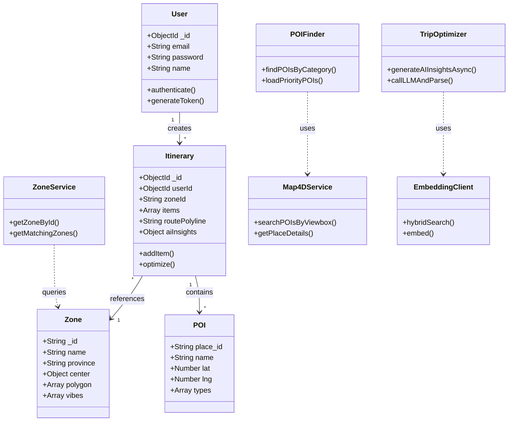
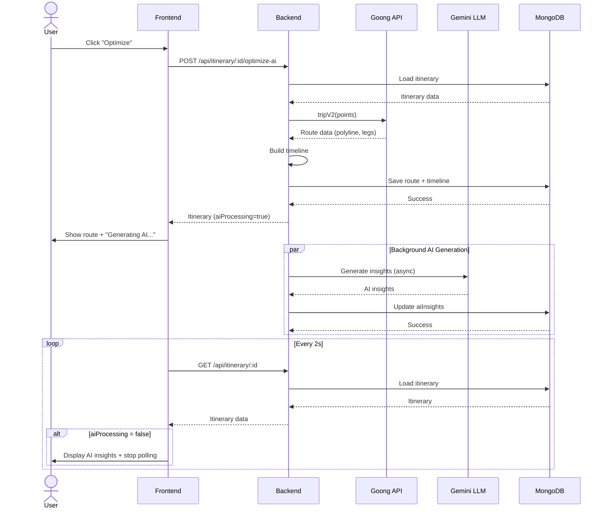

# Custom Itinerary System - Technical Specification
## For Class Diagram, Sequence Diagram, and Mermaid Generation

---

## 1. System Overview

**Feature**: Custom Itinerary Creation System  
**Purpose**: Allow users to create personalized travel itineraries by selecting zones and POIs, then optimize the route using AI/LLM.  
**Future**: Will support tour guide assignment (not implemented yet).

---

## 2. Authentication & Authorization

### 2.1 JWT Authentication Flow
```
User → Login → Server validates credentials → JWT token issued → Token stored in client
User → Protected API request → JWT sent in Authorization header → Server verifies JWT → Request processed
```

### 2.2 Middleware
- **Middleware**: `authJwt` (in `middlewares/authJWT.js`)
- **Function**: Validates JWT token, extracts user ID
- **Routes Protected**: 
  - `POST /api/itinerary`
  - `POST /api/itinerary/:id/items`
  - `DELETE /api/itinerary/:id/items/:poiId`
  - `POST /api/itinerary/:id/optimize-ai`
  - `GET /api/itinerary/:id`
  - `GET /api/itinerary/:id/export.gpx`

### 2.3 User ID Extraction
```javascript
function getUserId(user) {
  return user?.sub || user?._id || user?.id;
}
```

---

## 3. User Input & Preferences

### 3.1 User Provides
- **Hardsvibes**: Array of travel vibes (e.g., `["food", "photo", "beach"]`)
- **FreeText**: Optional free-text description (e.g., "Tôi muốn đi biển và ăn hải sản")
- **Avoid**: Array of things to avoid (e.g., `["crowded", "expensive"]`)
- **Province**: Optional province filter (e.g., "Da Nang")

### 3.2 API Endpoint
```
POST /api/discover/parse
Body: {
  vibes: ["food", "photo", "beach"],
  freeText: "Tôi muốn đi biển",
  avoid: ["crowded"],
  province: "Da Nang"
}
```

### 3.3 Response
```json
{
  "ok": true,
  "prefs": {
    "vibes": ["food", "photo", "beach", "relaxation"],
    "avoid": ["crowded"],
    "budget": "mid",
    "pace": "moderate"
  },
  "zones": [...],
  "strategy": "hybrid"
}
```

---

## 4. Zone Selection (AI Embedding)

### 4.1 Flow
```
User hardsvibes + freeText → Backend → Embedding Model (Python FastAPI)
  → Encode user input to vector
  → Compare with pre-encoded zone vectors (FAISS index)
  → Cosine similarity → Top N zones
  → Return zones to backend
```

### 4.2 Embedding Service (Python FastAPI)
- **URL**: `http://localhost:8088` (env: `EMBED_SERVICE_URL`)
- **Endpoints**:
  - `POST /hybrid-search`: Hybrid search (embedding + vibes)
  - `POST /search`: Basic semantic search
  - `POST /embed`: Generate embeddings
  - `POST /upsert`: Upsert items to FAISS index
  - `GET /healthz`: Health check

### 4.3 Embedding Client (Node.js)
- **File**: `services/ai/libs/embedding-client.js`
- **Functions**:
  - `hybridSearch(options)`: Hybrid search with vibes + free text
  - `search(query, options)`: Basic semantic search
  - `embed(texts)`: Generate embeddings
  - `upsert(items)`: Upsert items to index
  - `health()`: Check service health
  - `isAvailable()`: Check if service is available

### 4.4 Fallback Strategies
1. **Primary**: Embedding-based semantic search
2. **LLM Fallback**: Use LLM (Gemini) to suggest zones based on prompt (not implemented in current code)
3. **Heuristic Fallback**: Keyword matching, popularity scoring

### 4.5 Zone Matcher (Heuristic)
- **File**: `services/zones/matcher.js`
- **Function**: `getMatchingZones(prefs, options)`
- **Logic**:
  - If embedding service available → call `hybridSearch`
  - If not → use keyword matching on zone tags, description, province

---

## 5. POI Selection (Within Zones)

### 5.1 Flow
```
User selects zone → Frontend calls /api/zones/:zoneId/pois-priority
  → Backend queries Map4D API (primary) or Goong API (fallback)
  → Filter POIs by zone boundary (polygon/radius)
  → Rank POIs by category, rating, distance
  → Return POIs grouped by category
```

### 5.2 POI Categories
- **File**: `services/zones/poi-categories.js`
- **Categories**:
  - `views`: Điểm tham quan (viewpoints, landmarks)
  - `beach`: Bãi biển, resort
  - `nature`: Thiên nhiên, công viên
  - `food`: Quán ăn, nhà hàng
  - `culture`: Di tích, bảo tàng
  - `shopping`: Chợ, trung tâm thương mại
  - `nightlife`: Bar, quán nhậu

### 5.3 POI Finder
- **File**: `services/zones/poi-finder.js`
- **Functions**:
  - `findPOIsByCategory(zoneId, category, options)`: Find POIs by category
  - `loadPriorityPOIs(zoneId, options)`: Load priority POIs (views, beach, nature)
  - `searchPOIsInZone(zone, category, options)`: Search POIs in zone with Map4D

### 5.4 Map4D API (Primary)
- **File**: `services/ai/libs/map4d.js`
- **API Key**: `MAP4D_API_KEY` (env)
- **Endpoints**:
  - `GET /sdk/place/viewbox-search`: Search POIs in viewbox
  - `GET /sdk/place/nearby-search`: Search POIs nearby
  - `GET /sdk/place/text-search`: Search POIs by text
  - `GET /sdk/place/detail`: Get place details
  - `GET /sdk/autosuggest`: Autocomplete

### 5.5 Goong API (Fallback)
- **File**: `services/ai/libs/goong.js`
- **API Key**: `GOONG_API_KEY` (env)
- **Endpoints**:
  - `GET /Place/AutoComplete`: Autocomplete
  - `GET /Place/Detail`: Get place details
  - `GET /DistanceMatrix`: Distance matrix
  - `GET /v2/Trip`: Trip optimization (route)

### 5.6 POI Data Structure
```javascript
{
  place_id: "poi_123",
  name: "Bãi biển Mỹ Khê",
  lat: 16.0544,
  lng: 108.2315,
  location: { lat: 16.0544, lng: 108.2315 },
  address: "Đà Nẵng",
  types: ["beach", "tourist_attraction"],
  rating: 4.5,
  photos: ["photo_url_1", "photo_url_2"],
  source: "map4d"
}
```

---

## 6. Itinerary Creation (Cart)

### 6.1 Flow
```
User clicks "Add to Itinerary" → Frontend checks auth
  → If not logged in → Redirect to /login
  → If logged in → POST /api/itinerary (create or get draft)
  → POST /api/itinerary/:id/items (add POI)
  → POI added to items array
  → isOptimized = false
```

### 6.2 API Endpoints

#### Create/Get Draft Itinerary
```
POST /api/itinerary
Body: {
  zoneId: "dn-son-tra",
  zoneName: "Sơn Trà",
  preferences: {
    vibes: ["beach", "photo"],
    pace: "moderate",
    bestTime: "morning"
  }
}
Response: {
  success: true,
  itinerary: { _id, userId, zoneId, zoneName, preferences, items: [], status: "draft" }
}
```

#### Add POI to Itinerary
```
POST /api/itinerary/:id/items
Body: {
  poi: {
    place_id: "poi_123",
    name: "Bãi biển Mỹ Khê",
    lat: 16.0544,
    lng: 108.2315,
    address: "Đà Nẵng",
    types: ["beach"],
    rating: 4.5,
    photos: ["photo_url"]
  }
}
Response: {
  success: true,
  itinerary: { ..., items: [{ poiId, name, location, ... }] }
}
```

#### Remove POI from Itinerary
```
DELETE /api/itinerary/:id/items/:poiId
Response: { success: true, itinerary: { ... } }
```

#### Reorder POIs
```
PATCH /api/itinerary/:id/items/reorder
Body: { order: ["poi_1", "poi_2", "poi_3"] }
Response: { success: true, itinerary: { ... } }
```

### 6.3 Itinerary Model (MongoDB)
```javascript
{
  _id: ObjectId,
  userId: ObjectId,
  name: String,
  zoneId: String,
  zoneName: String,
  preferences: {
    vibes: [String],
    pace: String ("light" | "moderate" | "intense"),
    budget: String ("budget" | "mid" | "luxury"),
    durationDays: Number,
    bestTime: String ("morning" | "afternoon" | "evening" | "sunset" | "anytime")
  },
  items: [
    {
      poiId: String,
      name: String,
      address: String,
      location: { lat: Number, lng: Number },
      types: [String],
      rating: Number,
      photos: [String],
      startTime: String,
      endTime: String,
      duration: Number,
      timeSlot: String,
      travelFromPrevious: {
        distance: Number,
        duration: Number,
        mode: String
      }
    }
  ],
  status: String ("draft" | "optimized" | "confirmed"),
  routePolyline: String (encoded polyline),
  totalDistance: Number (km),
  totalDuration: Number (minutes),
  aiInsights: {
    summary: String,
    tips: [String]
  },
  aiProcessing: Boolean,
  isOptimized: Boolean,
  optimizedAt: Date
}
```

---

## 7. Route Optimization (AI + LLM)

### 7.1 Flow
```
User clicks "Optimize" → Frontend validates (min 2 POIs with coords)
  → POST /api/itinerary/:id/optimize-ai
  → Backend extracts POI coordinates
  → Call Map4D Directions API (primary) or Goong Trip API (fallback)
  → Get route polyline, distance, duration, legs
  → Build timeline (start/end times, travel times)
  → Save route data immediately
  → Return response to frontend
  → Generate AI insights in background (Gemini LLM)
  → Save AI insights when ready
```

### 7.2 API Endpoint
```
POST /api/itinerary/:id/optimize-ai
Response (immediate): {
  success: true,
  itinerary: {
    ...,
    routePolyline: "encoded_polyline",
    totalDistance: 2.63,
    totalDuration: 7,
    items: [
      {
        ...,
        startTime: "09:00",
        endTime: "09:45",
        duration: 45,
        timeSlot: "morning",
        travelFromPrevious: { distance: 1.2, duration: 5, mode: "driving" }
      }
    ],
    aiInsights: { summary: "⏳ Đang phân tích...", tips: ["⏳ Đang tải..."] },
    aiProcessing: true
  },
  message: "Route optimized. AI insights are being generated..."
}
```

### 7.3 Map4D Directions API (Primary)
- **File**: `services/ai/libs/map4d.js` (to be implemented)
- **Function**: `map4dDirections(points, options)`
- **Input**: `points` = `[[lng1, lat1], [lng2, lat2], ...]`
- **Output**: `{ distance, duration, geometry (encoded polyline), legs }`

### 7.4 Goong Trip API (Fallback)
- **File**: `services/ai/libs/goong.js`
- **Function**: `tripV2(points, options)`
- **Input**: `points` = `[[lng1, lat1], [lng2, lat2], ...]`
- **Output**: 
```json
{
  "code": "Ok",
  "trips": [{
    "distance": 2630,
    "duration": 420,
    "geometry": "encoded_polyline",
    "legs": [
      { "distance": 1200, "duration": 180, "steps": [...] },
      { "distance": 1430, "duration": 240, "steps": [...] }
    ]
  }],
  "waypoints": [...]
}
```

### 7.5 Timeline Builder
- **Logic** (in `routes/itinerary.routes.js`):
  1. Get zone best time window (e.g., morning = 07:30-11:30)
  2. Start from window start time
  3. For each POI:
     - Add travel time from previous POI (if any)
     - Set startTime = current time
     - Estimate stay duration by category/pace
     - Set endTime = startTime + duration
     - Set timeSlot (morning/afternoon/evening/night)
     - Add stay duration to current time
  4. Save timeline to `items` array

### 7.6 Gemini LLM (AI Insights)
- **File**: `services/itinerary/optimizer.js`
- **Function**: `generateAIInsightsAsync(itineraryId, itinerary, tripData)`
- **Model**: `gemini-2.0-flash-exp`
- **Prompt**: Builds structured prompt with:
  - Zone name
  - POI list (name, type, time slot)
  - Route info (distance, duration)
  - User preferences (vibes, pace, best time)
- **Output** (JSON):
```json
{
  "summary": "Hành trình này phù hợp cho những ai yêu biển và chụp ảnh...",
  "tips": [
    "Đến sớm để tránh đông người",
    "Mang theo kem chống nắng",
    "Đặt chỗ trước nếu muốn ăn tại nhà hàng"
  ]
}
```
- **Fallback**: If LLM fails/timeout → Generate placeholder tips

---

## 8. Display Optimized Itinerary

### 8.1 Frontend Flow
```
User navigates to /itinerary/result/:id
  → GET /api/itinerary/:id
  → Render timeline (POIs with start/end times, travel segments)
  → Render map (route polyline, markers)
  → Display AI insights (summary, tips)
  → If aiProcessing = true → Poll every 2s for updates
```

### 8.2 Frontend Components
- **ItineraryResult.jsx**: Main page
- **GoongMapLibre.jsx**: Map rendering (MapLibre GL JS)
- **Map4DPanel.jsx**: Map4D map rendering (react-map4d-map)

### 8.3 Map Rendering
- **Polyline Decoding**: Use `polyline` library to decode encoded polyline
- **GeoJSON**: Convert decoded polyline to GeoJSON LineString
- **Map Layer**: Add source + layer to map (line-color, line-width)
- **Fit Bounds**: Fit map to route bounds with padding

### 8.4 AI Insights Polling
- **Logic** (in `ItineraryResult.jsx`):
  - If `aiProcessing === true` → Start polling
  - Poll `GET /api/itinerary/:id` every 2 seconds
  - Stop polling when `aiProcessing === false`
  - Update UI with new AI insights

---

## 9. Database Schema

### 9.1 Users Collection
```javascript
{
  _id: ObjectId,
  email: String,
  password: String (hashed),
  name: String,
  role: String ("user" | "admin"),
  createdAt: Date
}
```

### 9.2 Zones Collection
```javascript
{
  _id: String ("dn-son-tra"),
  name: String ("Sơn Trà"),
  province: String ("Da Nang"),
  description: String,
  center: { lat: Number, lng: Number },
  polygon: [[Number, Number], ...] or { type: "Polygon", coordinates: [...] },
  radius: Number (meters),
  tags: [String],
  vibes: [String],
  bestTime: String,
  images: [String],
  priority: Number
}
```

### 9.3 Itineraries Collection
See section 6.3 for full schema.

---

## 10. Key API Integrations

### 10.1 Map4D API
- **Base URL**: `https://api.map4d.vn/sdk`
- **API Key**: `MAP4D_API_KEY`
- **Used For**: POI search, place details, autocomplete
- **Endpoints**:
  - `/place/viewbox-search`: Search POIs in viewbox
  - `/place/nearby-search`: Search POIs nearby
  - `/place/text-search`: Search POIs by text
  - `/place/detail`: Get place details
  - `/autosuggest`: Autocomplete

### 10.2 Goong API
- **Base URL**: `https://rsapi.goong.io`
- **API Key**: `GOONG_API_KEY`
- **Used For**: POI search (fallback), route optimization
- **Endpoints**:
  - `/Place/AutoComplete`: Autocomplete
  - `/Place/Detail`: Get place details
  - `/v2/Trip`: Trip optimization (route)

### 10.3 Embedding Service (Python FastAPI)
- **Base URL**: `http://localhost:8088`
- **Used For**: Semantic search, zone matching
- **Endpoints**:
  - `POST /hybrid-search`: Hybrid search (embedding + vibes)
  - `POST /search`: Basic semantic search
  - `POST /embed`: Generate embeddings
  - `POST /upsert`: Upsert items to FAISS index

### 10.4 Gemini LLM (Google AI)
- **Model**: `gemini-2.0-flash-exp`
- **API Key**: `GOOGLE_AI_API_KEY`
- **Used For**: AI insights, tips, summary
- **Config**:
  - `temperature`: 0.7
  - `maxOutputTokens`: 8192
  - `responseMimeType`: "application/json"

---

## 11. Key Classes & Methods (for Class Diagram)

### 11.1 Backend Classes

#### ZoneService (`services/zones/index.js`)
```
+ getZoneById(zoneId): Zone
+ getZonePOIs(zoneId, preferences): POI[]
+ getZonesByProvince(province): Zone[]
+ getMatchingZones(prefs, options): { zones, strategy }
```

#### POIFinder (`services/zones/poi-finder.js`)
```
+ findPOIsByCategory(zoneId, category, options): POI[]
+ loadPriorityPOIs(zoneId, options): { views, beach, nature, ... }
+ searchPOIsInZone(zone, category, options): POI[]
```

#### Map4DService (`services/ai/libs/map4d.js`)
```
+ searchPOIsByText(lat, lng, radius, options): POI[]
+ searchPOIsByViewbox(centerLat, centerLng, radius, options): POI[]
+ searchPOIsNearby(lat, lng, radius, options): POI[]
+ getPlaceDetails(placeId): POI
+ autocompletePlaces(input, lat, lng): Prediction[]
```

#### GoongService (`services/ai/libs/goong.js`)
```
+ searchNearbyPOIs(lat, lng, radius, options): POI[]
+ tripV2(points, options): TripData
+ getPlaceDetail(placeId, opts): POI
+ autoComplete(params): Prediction[]
```

#### EmbeddingClient (`services/ai/libs/embedding-client.js`)
```
+ hybridSearch(options): { hits, strategy }
+ search(query, options): { hits }
+ embed(texts): { embeddings }
+ upsert(items): { success }
+ health(): { status }
+ isAvailable(): Boolean
```

#### TripOptimizer (`services/itinerary/optimizer.js`)
```
+ buildItineraryPrompt(itinerary, tripData): String
+ callLLMAndParse(prompt): { summary, tips }
+ generateAIInsightsAsync(itineraryId, itinerary, tripData): void
```

#### ItineraryController (`routes/itinerary.routes.js`)
```
+ POST /api/itinerary: createItinerary()
+ POST /api/itinerary/:id/items: addPOI()
+ DELETE /api/itinerary/:id/items/:poiId: removePOI()
+ PATCH /api/itinerary/:id/items/reorder: reorderPOIs()
+ POST /api/itinerary/:id/optimize-ai: optimizeItinerary()
+ GET /api/itinerary/:id: getItinerary()
+ GET /api/itinerary/:id/export.gpx: exportGPX()
```

#### ZoneController (`routes/zone.routes.js`)
```
+ GET /api/zones/:zoneId: getZone()
+ GET /api/zones/:zoneId/pois: getZonePOIs()
+ GET /api/zones/:zoneId/pois/:category: getPOIsByCategory()
+ GET /api/zones/:zoneId/pois-priority: getPriorityPOIs()
+ GET /api/zones/province/:province: getZonesByProvince()
```

#### DiscoverController (`routes/discover.routes.js`)
```
+ POST /api/discover/parse: parsePreferences()
```

### 11.2 Models

#### User
```
- _id: ObjectId
- email: String
- password: String
- name: String
- role: String
+ authenticate(): Boolean
+ generateToken(): String
```

#### Zone
```
- _id: String
- name: String
- province: String
- description: String
- center: { lat, lng }
- polygon: Array or GeoJSON
- radius: Number
- tags: [String]
- vibes: [String]
- bestTime: String
```

#### Itinerary
```
- _id: ObjectId
- userId: ObjectId
- name: String
- zoneId: String
- zoneName: String
- preferences: Object
- items: [ItineraryItem]
- status: String
- routePolyline: String
- totalDistance: Number
- totalDuration: Number
- aiInsights: { summary, tips }
- aiProcessing: Boolean
- isOptimized: Boolean
+ addItem(poi): void
+ removeItem(poiId): void
+ reorderItems(order): void
+ optimize(): void
```

#### ItineraryItem
```
- poiId: String
- name: String
- address: String
- location: { lat, lng }
- types: [String]
- rating: Number
- photos: [String]
- startTime: String
- endTime: String
- duration: Number
- timeSlot: String
- travelFromPrevious: { distance, duration, mode }
```

#### POI
```
- place_id: String
- name: String
- lat: Number
- lng: Number
- location: { lat, lng }
- address: String
- types: [String]
- rating: Number
- photos: [String]
- source: String
```

---

## 12. Sequence Diagrams (Detailed)

### 12.1 Zone Discovery & Selection
```
User → Frontend: Enter vibes + freeText
Frontend → Backend: POST /api/discover/parse
Backend → LLM (Gemini): Parse preferences
LLM → Backend: { vibes, avoid, budget, pace }
Backend → EmbeddingClient: hybridSearch({ vibes, freeText })
EmbeddingClient → Python FastAPI: POST /hybrid-search
Python FastAPI → FAISS Index: Semantic search
FAISS Index → Python FastAPI: Top N zones
Python FastAPI → EmbeddingClient: { hits, strategy }
EmbeddingClient → Backend: { zones, strategy }
Backend → Frontend: { zones, prefs, strategy }
Frontend → User: Display zones
```

### 12.2 POI Discovery & Cart
```
User → Frontend: Select zone "Sơn Trà"
Frontend → Backend: GET /api/zones/:zoneId/pois-priority
Backend → ZoneService: loadPriorityPOIs(zoneId)
ZoneService → POIFinder: findPOIsByCategory(zoneId, "views")
POIFinder → Map4DService: searchPOIsByViewbox(lat, lng, radius)
Map4DService → Map4D API: GET /place/viewbox-search
Map4D API → Map4DService: POIs
Map4DService → POIFinder: POIs
POIFinder → ZoneService: POIs (filtered by boundary)
ZoneService → Backend: { views: [...], beach: [...], nature: [...] }
Backend → Frontend: POIs by category
Frontend → User: Display POIs in tabs

User → Frontend: Click "Add to Itinerary" on POI
Frontend → Backend: POST /api/itinerary (create/get draft)
Backend → MongoDB: findOne({ userId, zoneId, status: "draft" })
MongoDB → Backend: Existing draft or null
Backend → Frontend: { itinerary }

Frontend → Backend: POST /api/itinerary/:id/items
Backend → MongoDB: Add POI to items array
MongoDB → Backend: Updated itinerary
Backend → Frontend: { itinerary }
Frontend → User: "POI added to itinerary"
```

### 12.3 Route Optimization & AI Insights
```
User → Frontend: Click "Optimize Itinerary"
Frontend → Backend: POST /api/itinerary/:id/optimize-ai
Backend → MongoDB: Load itinerary
MongoDB → Backend: Itinerary

Backend → GoongService: tripV2(points, { vehicle: "car" })
GoongService → Goong API: GET /v2/Trip
Goong API → GoongService: { trips, waypoints, geometry }
GoongService → Backend: TripData

Backend → Timeline Builder: buildTimeline(itinerary, tripData)
Timeline Builder → Backend: Updated items with times

Backend → MongoDB: Save route + timeline
MongoDB → Backend: Success

Backend → Frontend: { itinerary (with route, no AI yet), aiProcessing: true }
Frontend → User: Display route + timeline + "⏳ Generating AI insights..."

Backend (async) → TripOptimizer: generateAIInsightsAsync(itineraryId, itinerary, tripData)
TripOptimizer → Gemini LLM: POST /generateContent (prompt)
Gemini LLM → TripOptimizer: { summary, tips }
TripOptimizer → MongoDB: Update aiInsights, aiProcessing = false
MongoDB → TripOptimizer: Success

Frontend (polling) → Backend: GET /api/itinerary/:id (every 2s)
Backend → MongoDB: Load itinerary
MongoDB → Backend: Itinerary (with AI insights, aiProcessing = false)
Backend → Frontend: { itinerary }
Frontend → User: Display AI insights + stop polling
```

---

## 13. Database Queries (Key Operations)

### 13.1 User Authentication
```javascript
// Login
User.findOne({ email: req.body.email })

// Verify JWT
jwt.verify(token, secret)
```

### 13.2 Zone Operations
```javascript
// Get zone by ID
Zone.findById(zoneId)

// Get zones by province
Zone.find({ province: "Da Nang" })

// Get all zones (for embedding upsert)
Zone.find({})
```

### 13.3 Itinerary Operations
```javascript
// Create or get draft
Itinerary.findOne({ userId, zoneId, status: "draft" })
Itinerary.create({ userId, zoneId, zoneName, preferences, items: [] })

// Add POI
Itinerary.findOne({ _id: itineraryId, userId })
itinerary.items.push(newItem)
itinerary.save()

// Remove POI
Itinerary.findOne({ _id: itineraryId, userId })
itinerary.items = itinerary.items.filter(item => item.poiId !== poiId)
itinerary.save()

// Reorder POIs
Itinerary.findOne({ _id: itineraryId, userId })
itinerary.items = reorderedItems
itinerary.save()

// Optimize route
Itinerary.findOne({ _id: itineraryId, userId })
itinerary.routePolyline = geometry
itinerary.totalDistance = distance
itinerary.totalDuration = duration
itinerary.items = updatedItems
itinerary.isOptimized = true
itinerary.save()

// Update AI insights (async)
Itinerary.findById(itineraryId)
itinerary.aiInsights = { summary, tips }
itinerary.aiProcessing = false
itinerary.save()

// Get itinerary by ID
Itinerary.findOne({ _id: itineraryId, userId })

// Get user's itineraries
Itinerary.find({ userId }).sort({ createdAt: -1 }).limit(10)
```

---

## 14. External API Calls

### 14.1 Map4D API
```javascript
// Viewbox search
GET https://api.map4d.vn/sdk/place/viewbox-search?key=xxx&viewbox=lat1,lng1,lat2,lng2&text=query&types=

// Nearby search
GET https://api.map4d.vn/sdk/place/nearby-search?key=xxx&location=lat,lng&radius=meters&text=query&types=

// Place detail
GET https://api.map4d.vn/sdk/place/detail?key=xxx&placeid=xxx

// Autosuggest
GET https://api.map4d.vn/sdk/autosuggest?key=xxx&text=query&location=lat,lng
```

### 14.2 Goong API
```javascript
// Trip V2
GET https://rsapi.goong.io/v2/trip?origin=lat,lng&destination=lat,lng&waypoints=lat,lng;lat,lng&vehicle=car&api_key=xxx

// Autocomplete
GET https://rsapi.goong.io/Place/AutoComplete?input=query&location=lat,lng&radius=meters&api_key=xxx

// Place detail
GET https://rsapi.goong.io/Place/Detail?place_id=xxx&api_key=xxx
```

### 14.3 Embedding Service (Python FastAPI)
```javascript
// Hybrid search
POST http://localhost:8088/hybrid-search
Body: {
  free_text: "Tôi muốn đi biển",
  vibes: ["beach", "photo"],
  avoid: ["crowded"],
  top_k: 10,
  filter_province: "Da Nang"
}

// Basic search
POST http://localhost:8088/search
Body: { query: "beach", top_k: 10 }

// Embed
POST http://localhost:8088/embed
Body: { texts: ["beach", "mountain"] }

// Upsert
POST http://localhost:8088/upsert
Body: {
  items: [
    { id: "zone_1", text: "Beautiful beach", metadata: {...} }
  ]
}

// Health check
GET http://localhost:8088/healthz
```

### 14.4 Gemini LLM
```javascript
// Generate content
POST https://generativelanguage.googleapis.com/v1beta/models/gemini-2.0-flash-exp:generateContent
Body: {
  contents: [{
    parts: [{
      text: "Prompt..."
    }]
  }],
  generationConfig: {
    temperature: 0.7,
    maxOutputTokens: 8192,
    responseMimeType: "application/json"
  }
}
```

---

## 15. Mermaid Diagram Templates

### 15.1 Class Diagram (Simplified)


### 15.2 Sequence Diagram (Optimize Itinerary)


---

## 16. Notes for Diagram Creation

### 16.1 Key Points to Highlight
1. **JWT Authentication**: Always validate before protected operations
2. **Embedding + LLM Fallback**: Primary semantic search, fallback to keyword/heuristic
3. **Map4D Primary, Goong Fallback**: Try Map4D first, use Goong if fails
4. **Async AI Generation**: Route optimization returns immediately, AI runs in background
5. **Polling**: Frontend polls for AI insights until ready
6. **Multiple Coordinate Formats**: Store lat/lng in multiple formats for compatibility

### 16.2 Class Relationships
- User → Itinerary (1:N)
- Itinerary → Zone (N:1)
- Itinerary → ItineraryItem (1:N)
- ZoneService → Zone (queries)
- POIFinder → Map4DService, GoongService (uses)
- TripOptimizer → GoongService, GeminiLLM (uses)
- EmbeddingClient → Python FastAPI (calls)

### 16.3 Sequence Flow Summary
1. **Discovery**: User input → LLM parse → Embedding search → Zones
2. **POI Selection**: Zone selected → POI search (Map4D/Goong) → Filter → Display
3. **Cart**: Add POI → Create/update itinerary → Save to DB
4. **Optimization**: Extract coords → Call trip API → Build timeline → Save route → Return → Generate AI (async) → Poll for AI

---

*Document generated for Mermaid class diagram, sequence diagram, and technical specification - October 30, 2025*
