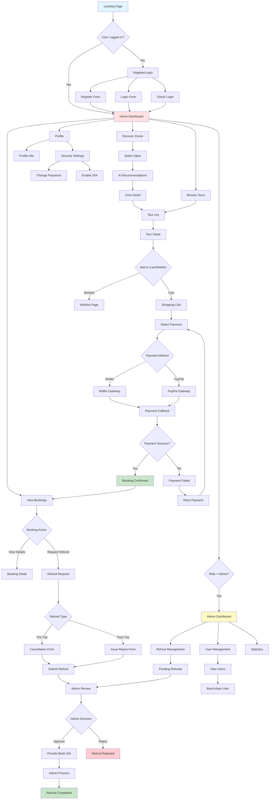
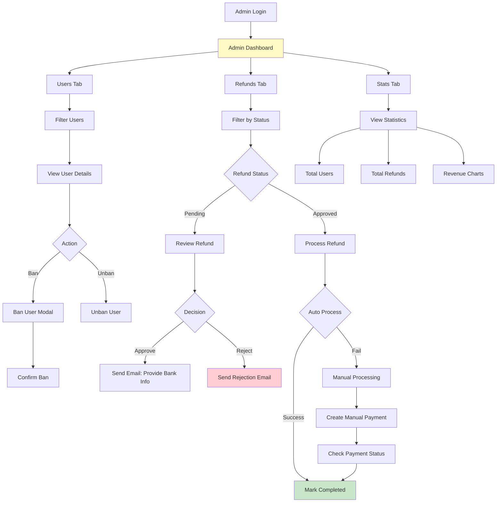

# TRAVYY - Touring Website

## Final Project Deliverables & Documentation

**Project Code**: TRAVYY-2025  
**Version**: 1.0  
**Last Updated**: November 14, 2025  
**Team**: G1-TRAVYY

---

## I. Deliverable Package

[This section lists all source programs, scripts, documents with version numbers in this release]

| No. | File                                  | Notes                                                                                                                                                                                                                                                                                                          |
| --- | ------------------------------------- | -------------------------------------------------------------------------------------------------------------------------------------------------------------------------------------------------------------------------------------------------------------------------------------------------------------- |
| 1   | `TRAVYY_MongoDB_Schema.js`            | MongoDB database schema files (Users, Bookings, Refunds, Tours, Zones, Carts, Wishlists, Promotions, Reviews, PaymentSessions) - Full collection definitions with indexes                                                                                                                                      |
| 2   | `TRAVYY_SRS_final.docx`               | Final Software Requirements Specification Document - Contains all functional and non-functional requirements                                                                                                                                                                                                   |
| 3   | `RDS`                                 | Requirements & Dependencies Specification - Assumptions (AS-1 to AS-9), Dependencies (DE-1 to DE-7), Limitations (LX-1 to LX-10)                                                                                                                                                                               |
| 4   | `AUTHENTICATION_SEQUENCE_DIAGRAMS.md` | Complete technical specification with sequence diagrams for:<br/>- Authentication (Register, Login, OAuth, 2FA)<br/>- Cart & Wishlist operations<br/>- Payment Processing (MoMo, PayPal, Retry Payment)<br/>- Refund System (Pre-trip, Post-trip, Admin workflows)<br/>- Admin User Management                 |
| 5   | `TRAVYY_Product_Backlog.xlsx`         | Final status for application functions including:<br/>- Function name, feature, roles, function description<br/>- Sprint/Iteration tracking<br/>- Final status & notes<br/>- Links to SRS & technical docs                                                                                                     |
| 6   | `TRAVYY_Issues_Report.xlsx`           | Final issues tracking list of the whole project including bugs, enhancements, technical debt                                                                                                                                                                                                                   |
| 7   | `touring-be/`                         | Backend source code (Node.js/Express):<br/>- API routes (auth, payment, booking, refund, admin)<br/>- Controllers & Services<br/>- Models (Mongoose schemas)<br/>- Middleware (JWT auth, admin verification)<br/>- Config files                                                                                |
| 8   | `touring-fe/`                         | Frontend source code (React + Vite):<br/>- Pages (30+ screens)<br/>- Components (UI components, forms, modals)<br/>- Services (API clients)<br/>- State management<br/>- Routing configuration                                                                                                                 |
| 9   | `ai/`                                 | AI/ML microservice (Python FastAPI):<br/>- Vietnamese Embedding Service (AITeamVN/Vietnamese_Embedding_v2 - 1024-dim)<br/>- FAISS vector search (FLAT/HNSW/IVF index types)<br/>- Semantic zone/POI matching<br/>- REST API endpoints: /embed, /upsert, /search, /stats<br/>- Requirements: `requirements.txt` |
| 10  | `package.json` (BE & FE)              | Dependencies manifest:<br/>- Backend: express, mongoose, bcrypt, jsonwebtoken, axios, node-cron, etc.<br/>- Frontend: react, react-router-dom, axios, tailwindcss, etc.                                                                                                                                        |
| 11  | `README.md`                           | Project overview, setup instructions, tech stack summary                                                                                                                                                                                                                                                       |
| 12  | `.env.example` (BE & AI)              | Environment variables template:<br/>- Database connection strings<br/>- Payment gateway credentials (MoMo, PayPal)<br/>- Email service config<br/>- JWT secrets<br/>- AI service endpoints                                                                                                                     |
| 13  | Test files                            | Unit tests for critical flows:<br/>- Payment processing tests<br/>- Refund calculation tests<br/>- Authentication middleware tests                                                                                                                                                                             |

### Other Related Deliverables

- **Source Code Repository**: [GitHub Repository Link - jayykioh/TRAVYY-touring-website]
- **Tagged Release**: `git tag v1.0.0` (Branch: `dong`)
- **Demonstration Video**: [YouTube Link - TRAVYY System Demo]
- **Live Demo (Staging)**: [Staging URL if deployed]
- **API Documentation**: Postman Collection or Swagger/OpenAPI spec (if available)

---

## II. Installation Guides

### Prerequisites

Before installation, ensure you have the following installed:

1. **Node.js** >= v16.x (recommend v18.x or v20.x)
2. **npm** >= 8.x or **yarn** >= 1.22.x
3. **MongoDB** >= v4.4 (recommend v6.x or MongoDB Atlas account)
4. **Python** >= 3.9 (for AI service)
5. **Git** for version control

### System Architecture

```
TRAVYY-touring-website/
├── touring-be/        # Backend API (Node.js/Express) - Port 4000
├── touring-fe/        # Frontend Web App (React/Vite) - Port 5173
└── ai/                # AI Embedding Service (Python/FastAPI) - Port 8088
```

---

### A. Backend Installation (touring-be)

#### Step 1: Navigate to Backend Directory

```bash
cd touring-be
```

#### Step 2: Install Dependencies

```bash
npm install
```

#### Step 3: Configure Environment Variables

Create `.env` file in `touring-be/` directory:

```bash
cp .env.example .env
```

Edit `.env` with your credentials:

```env
# Server
PORT=4000
NODE_ENV=development

# MongoDB
MONGO_URI=mongodb://localhost:27017/travyy
# Or use MongoDB Atlas:
# MONGO_URI=mongodb+srv://<username>:<password>@cluster.mongodb.net/travyy

# JWT
JWT_SECRET=your-super-secret-jwt-key-change-this-in-production
JWT_REFRESH_SECRET=your-refresh-token-secret-key
JWT_EXPIRES_IN=15m
JWT_REFRESH_EXPIRES_IN=30d

# MoMo Payment Gateway
MOMO_PARTNER_CODE=your-momo-partner-code
MOMO_ACCESS_KEY=your-momo-access-key
MOMO_SECRET_KEY=your-momo-secret-key
MOMO_ENDPOINT=https://test-payment.momo.vn
MOMO_REDIRECT_URL=http://localhost:5173/payment/callback
MOMO_IPN_URL=http://your-server-domain/api/payments/momo-ipn

# PayPal
PAYPAL_CLIENT_ID=your-paypal-client-id
PAYPAL_CLIENT_SECRET=your-paypal-client-secret
PAYPAL_MODE=sandbox
PAYPAL_ENDPOINT=https://api-m.sandbox.paypal.com

# Email Service (SendGrid or SMTP)
EMAIL_SERVICE=gmail
EMAIL_USER=your-email@gmail.com
EMAIL_PASSWORD=your-app-password
# Or use SendGrid:
# SENDGRID_API_KEY=your-sendgrid-api-key

# Frontend URL
FRONTEND_URL=http://localhost:5173

# Google OAuth
GOOGLE_CLIENT_ID=your-google-client-id
GOOGLE_CLIENT_SECRET=your-google-client-secret

# Facebook OAuth
FACEBOOK_APP_ID=your-facebook-app-id
FACEBOOK_APP_SECRET=your-facebook-app-secret

# AI Service
AI_SERVICE_URL=http://localhost:8088
EMBED_URL=http://localhost:8088
```

#### Step 4: Start Backend Server

**Development mode** (with auto-reload):

```bash
npm run dev
```

**Production mode**:

```bash
npm start
```

Backend server should be running on: `http://localhost:4000`

#### Step 5: Verify Backend

Open browser or use curl:

```bash
curl http://localhost:4000/api/health
```

Expected response:

```json
{ "status": "ok", "message": "TRAVYY Backend is running" }
```

---

### B. Frontend Installation (touring-fe)

#### Step 1: Navigate to Frontend Directory

```bash
cd touring-fe
```

#### Step 2: Install Dependencies

```bash
npm install
```

#### Step 3: Configure Environment Variables

Create `.env` file in `touring-fe/` directory:

```bash
cp .env.example .env
```

Edit `.env`:

```env
VITE_API_BASE_URL=http://localhost:4000/api
VITE_PAYPAL_CLIENT_ID=your-paypal-client-id
VITE_GOOGLE_CLIENT_ID=your-google-client-id
VITE_FACEBOOK_APP_ID=your-facebook-app-id
```

#### Step 4: Start Frontend Development Server

```bash
npm run dev
```

Frontend should be running on: `http://localhost:5173`

#### Step 5: Build for Production (Optional)

```bash
npm run build
```

Preview production build:

```bash
npm run preview
```

---

### C. AI Embedding Service Installation (ai/)

**Note**: AI service sử dụng FastAPI (không phải Flask) với Vietnamese Embedding model và FAISS vector search.

#### Step 1: Navigate to AI Directory

```bash
cd ai
```

#### Step 2: Create Python Virtual Environment

```bash
python -m venv .venv
source .venv/bin/activate  # On macOS/Linux
# .venv\Scripts\activate   # On Windows
```

#### Step 3: Install Python Dependencies

```bash
pip install -r requirements.txt
```

#### Step 4: Configure Environment Variables

Create `.env` file in `ai/` directory:

```bash
cp .env.example .env
```

Edit `.env`:

```env
# MongoDB (for zone/itinerary data)
MONGO_URI=mongodb://localhost:27017/travyy

# OpenAI API (for LLM-based parsing & insights)
OPENAI_API_KEY=your-openai-api-key

# Embedding Service
PORT=8088
INDEX_TYPE=FLAT
# Options: FLAT (exact search), HNSW (fast ANN), IVF (for large datasets)

# FastAPI
UVICORN_HOST=0.0.0.0
UVICORN_PORT=8088
```

#### Step 5: Start AI Embedding Service

**Development mode** (with auto-reload):

```bash
uvicorn app:app --reload --port 8088
```

**Production mode**:

```bash
uvicorn app:app --host 0.0.0.0 --port 8088 --workers 4
```

AI embedding service should be running on: `http://localhost:8088`

#### Step 6: Verify Service

```bash
# Health check
curl http://localhost:8088/healthz

# Stats
curl http://localhost:8088/stats

# Test embedding
curl -s http://localhost:8088/embed -X POST \
  -H "Content-Type: application/json" \
  -d '{"texts": ["đi biển với người yêu, yên tĩnh, ngắm hoàng hôn"]}'
```

Expected response:

```json
{
  "embeddings": [[0.123, -0.456, ...]],
  "dimension": 1024,
  "count": 1
}
```

#### Step 7: Upsert Zone Embeddings (Initial Setup)

Để sử dụng semantic search, cần upsert zone data vào FAISS index:

```bash
# Method 1: Via REST API
curl -s http://localhost:8088/upsert -X POST \
  -H "Content-Type: application/json" \
  -d @- <<'JSON'
{
  "items": [
    {
      "id": "zone:da-nang-son-tra",
      "type": "zone",
      "text": "Bán đảo Sơn Trà. Thiên nhiên yên tĩnh, ngắm biển, hoàng hôn, ảnh đẹp.",
      "payload": {"province": "Đà Nẵng", "name": "Bán đảo Sơn Trà"}
    },
    {
      "id": "zone:dn-an-thuong",
      "type": "zone",
      "text": "Khu An Thượng. Ẩm thực, bar club, gần biển, sôi động về đêm.",
      "payload": {"province": "Đà Nẵng", "name": "Khu An Thượng"}
    }
  ]
}
JSON

# Method 2: Via Python script (if available)
python sync_zones_from_mongo.py
```

#### Step 8: Test Semantic Search

```bash
curl -s http://localhost:8088/search -X POST \
  -H "Content-Type: application/json" \
  -d '{
    "query": "đi một tuần với người yêu, thích yên tĩnh, hoàng hôn",
    "top_k": 5,
    "filter_type": "zone"
  }'
```

Expected response:

```json
{
  "hits": [
    {
      "id": "zone:da-nang-son-tra",
      "score": 0.876,
      "type": "zone",
      "payload": { "province": "Đà Nẵng", "name": "Bán đảo Sơn Trà" }
    }
  ],
  "query_time_ms": 12
}
```

---

### D. Database Setup

#### Option 1: Local MongoDB

1. Install MongoDB Community Edition from [mongodb.com/download](https://www.mongodb.com/try/download/community)
2. Start MongoDB service:

```bash
# macOS
brew services start mongodb-community

# Linux
sudo systemctl start mongod

# Windows
# MongoDB runs as a service automatically
```

3. Create database (auto-created on first connection)

#### Option 2: MongoDB Atlas (Cloud)

1. Sign up at [mongodb.com/atlas](https://www.mongodb.com/cloud/atlas)
2. Create a free cluster
3. Get connection string: `mongodb+srv://<username>:<password>@cluster.mongodb.net/travyy`
4. Update `MONGO_URI` in backend and AI `.env` files
5. Whitelist your IP address in Network Access

---

### E. Running the Complete System

**Terminal 1** - Backend:

```bash
cd touring-be
npm run dev
```

**Terminal 2** - Frontend:

```bash
cd touring-fe
npm run dev
```

**Terminal 3** - AI Embedding Service:

```bash
cd ai
source .venv/bin/activate
uvicorn app:app --reload --port 8088
```

**Terminal 4** - MongoDB (if local):

```bash
mongod --dbpath /path/to/your/data
```

---

### F. Troubleshooting

#### Issue 1: Port Already in Use

```bash
# Kill process on port 4000 (backend)
lsof -ti:4000 | xargs kill -9

# Kill process on port 5173 (frontend)
lsof -ti:5173 | xargs kill -9

# Kill process on port 8088 (AI service)
lsof -ti:8088 | xargs kill -9
```

#### Issue 2: MongoDB Connection Failed

- Check if MongoDB is running: `mongosh` or `mongo`
- Verify `MONGO_URI` in `.env`
- For Atlas: Check network access whitelist

#### Issue 3: Payment Gateway Errors

- Verify sandbox credentials for MoMo/PayPal
- Check `MOMO_IPN_URL` is accessible (use ngrok for localhost)
- Ensure `PAYPAL_MODE=sandbox` for testing

#### Issue 4: AI Service Errors

- Check if uvicorn is running: `ps aux | grep uvicorn`
- Verify Python dependencies: `pip list | grep -E "fastapi|uvicorn|faiss|sentence-transformers"`
- Test embedding endpoint: `curl http://localhost:8088/healthz`
- Check FAISS index stats: `curl http://localhost:8088/stats`
- If "No vectors in index" → Run upsert or sync script first
- Check logs for model download progress (Vietnamese_Embedding_v2 ~400MB first time)

---

## III. User Manual

### 1. Overview

**TRAVYY** là hệ thống website đặt tour du lịch toàn diện, cung cấp trải nghiệm từ khám phá điểm đến, lên lịch trình AI, đặt tour, thanh toán trực tuyến đến quản lý booking và hoàn tiền.

#### Key Features

- **🔐 Authentication**: Đăng ký/Đăng nhập (Email, Google, Facebook), Two-Factor Authentication (2FA), Email Verification
- **🗺️ Discovery**: AI-powered zone recommendations based on vibes & preferences
- **📅 Itinerary Planning**: AI tự động tạo lịch trình du lịch
- **🛒 Shopping Cart & Wishlist**: Quản lý tours yêu thích và giỏ hàng
- **💳 Payment**: Thanh toán qua MoMo (VND) và PayPal (USD)
- **📖 Booking Management**: Xem lịch sử đặt tour, retry failed payments
- **💰 Refund System**: Yêu cầu hoàn tiền (pre-trip cancellation & post-trip issues)
- **👤 User Profile**: Quản lý thông tin cá nhân, đổi mật khẩu, bảo mật tài khoản
- **🛡️ Admin Dashboard**: Quản lý users, bookings, refunds, statistics

#### System Actors

| Actor                | Role                      | Description                                                                                    |
| -------------------- | ------------------------- | ---------------------------------------------------------------------------------------------- |
| **Traveler** (User)  | End user                  | Người dùng cuối, tìm kiếm tour, đặt booking, thanh toán, yêu cầu refund                        |
| **Admin**            | System administrator      | Quản trị viên hệ thống, quản lý users, approve/reject refunds, xem statistics                  |
| **TourGuide**        | Tour guide (Future)       | Hướng dẫn viên du lịch (hiện chưa có chức năng riêng, được quản lý qua TravelAgency)           |
| **TravelAgency**     | Travel agency (Data only) | Công ty du lịch - CHỈ LÀ FAKE API để fetch dữ liệu tour/agency, không có login/dashboard riêng |
| **External Systems** | Third-party APIs          | MoMo Payment Gateway, PayPal, Email Service, AI/OpenAI                                         |

**Lưu ý**: `TravelAgency` chỉ là data model để lưu thông tin công ty du lịch và guides, không phải actor có thể login vào hệ thống.

---

### 2. Workflow: User Registration & Login

#### Purpose

Cho phép người dùng tạo tài khoản mới hoặc đăng nhập vào hệ thống bằng email/password hoặc OAuth (Google, Facebook).

#### Steps

##### 2.1. Registration (Đăng ký)

**Screen**: Registration Page (`/register`)


1. Người dùng truy cập trang chủ → Click **"Đăng ký"** ở góc phải trên
2. Điền form đăng ký:
   - **Email**: Nhập email hợp lệ (required)
   - **Password**: Tối thiểu 8 ký tự, có chữ hoa, chữ thường, số, ký tự đặc biệt (required)
   - **Confirm Password**: Nhập lại mật khẩu (required)
   - **Full Name**: Họ và tên (required)
   - **Phone**: Số điện thoại (optional)
3. Click **"Đăng ký"**
4. Hệ thống validation:
   - ✅ Email chưa tồn tại
   - ✅ Password đủ mạnh
   - ✅ Confirm password khớp
5. Nếu thành công:
   - Tạo tài khoản với `role: "Traveler"`, `accountStatus: "active"`
   - Tự động đăng nhập
   - Redirect đến trang chủ
   - Toast hiển thị: "Đăng ký thành công! Chào mừng bạn đến TRAVYY 🎉"

**Alternative Flows**:

- **OAuth Registration**: Click "Đăng ký với Google" hoặc "Facebook" → Redirect đến OAuth provider → Auto-create account sau khi authorize

##### 2.2. Login (Đăng nhập)

**Screen**: Login Page (`/login`)


1. Người dùng truy cập trang chủ → Click **"Đăng nhập"**
2. Điền thông tin:
   - **Email/Username**: Nhập email đã đăng ký
   - **Password**: Nhập mật khẩu
3. (Optional) Check **"Ghi nhớ đăng nhập"** để lưu session dài hạn
4. Click **"Đăng nhập"**
5. Hệ thống kiểm tra:
   - ✅ Email tồn tại
   - ✅ Password đúng
   - ✅ Account không bị banned (`accountStatus !== "banned"`)
6. Nếu **2FA enabled**:
   - Hiển thị modal nhập OTP (6 digits)
   - User nhập code từ Google Authenticator
   - Verify OTP → Nếu đúng → Login thành công
7. Nếu thành công:
   - Backend tạo Access Token (15 phút) + Refresh Token (30 ngày)
   - Lưu tokens vào HttpOnly cookies
   - Redirect đến trang trước đó hoặc Home
   - Toast: "Đăng nhập thành công! Chào mừng trở lại 👋"

**Error Handling**:

- Email không tồn tại → "Email không tồn tại trong hệ thống"
- Password sai → "Mật khẩu không chính xác"
- Account banned → "Tài khoản đã bị khóa. Lý do: [reason]"
- 2FA OTP sai → "Mã xác thực không chính xác, vui lòng thử lại"

---

### 3. Workflow: AI Discovery & Tour Booking

#### Purpose

Cho phép user khám phá điểm đến phù hợp dựa trên sở thích (vibes), xem chi tiết tours, thêm vào cart và đặt booking.

#### Steps

##### 3.1. AI-Powered Zone Discovery

**Screen**: Discover Page (`/discover`)


1. User truy cập **"Khám phá"** từ menu
2. Chọn vibes (tags) phù hợp với sở thích:
   - 🏖️ Beach (Biển)
   - 🍜 Food (Ẩm thực)
   - 🌄 Mountain (Núi)
   - 🌆 City (Thành phố)
   - 🎭 Culture (Văn hóa)
   - 🌅 Sunset (Hoàng hôn)
   - ... (tổng 20+ vibes)
3. (Optional) Nhập free text mô tả chi tiết: "Tôi muốn đi biển yên tĩnh, có hải sản ngon, view đẹp chụp ảnh"
4. Click **"Tìm kiếm"**
5. Hệ thống gửi request đến AI service:
   - Parse vibes + free text
   - Tính embedding vector
   - So sánh với zone embeddings trong database
   - Rank theo match score (embedding + rule-based)
6. Hiển thị kết quả:
   - Top 10-20 zones phù hợp nhất
   - Mỗi zone card hiển thị: Ảnh, tên, match score, vibes tags, short description
7. User click vào zone card → Redirect đến **Zone Detail Page**

##### 3.2. Zone Detail & Available Tours

**Screen**: Zone Detail Page (`/zones/:zoneId`)


1. Hiển thị thông tin chi tiết zone:
   - Banner image
   - Zone name & description
   - Location (province, region)
   - Highlights
   - Vibes/tags
2. Section **"Available Tours"**:
   - Danh sách các tours thuộc zone này
   - Filter: Price range, duration, start date
   - Sort: Price (low→high, high→low), Rating, Duration
3. User click vào tour card → Redirect đến **Tour Detail Page**

##### 3.3. Tour Detail & Add to Cart

**Screen**: Tour Detail Page (`/tours/:tourId`)


1. Hiển thị đầy đủ thông tin tour:
   - Tour name, images, price (per person)
   - Duration, max group size
   - Itinerary (day-by-day schedule)
   - Inclusions & Exclusions
   - Reviews & ratings
2. User chọn:
   - **Start Date**: Chọn ngày khởi hành từ calendar
   - **Number of Tickets**: Số lượng vé (1-10)
3. Click **"Thêm vào giỏ hàng"**
4. Hệ thống:
   - Check seat availability: `tour.availableSeats >= quantity`
   - Calculate price: `pricePerPerson * quantity`
   - Add to cart (hoặc update quantity nếu đã có)
   - Toast: "Đã thêm vào giỏ hàng ✅"
5. User có thể:
   - **Continue shopping**: Quay lại tìm tour khác
   - **Go to Cart**: Click icon giỏ hàng → Redirect `/cart`

##### 3.4. Cart & Checkout

**Screen**: Cart Page (`/cart`)


1. Hiển thị danh sách tours trong cart:
   - Tour name, image, start date
   - Price per person × quantity = Subtotal
   - Actions: Update quantity, Remove item
2. User có thể:
   - Apply **voucher code**: Nhập code → Click "Áp dụng" → Discount tính tự động
   - View **Total Amount**: Subtotal - Discount = Final Total
3. Click **"Thanh toán"**
4. Chọn payment method:
   - **MoMo** (thanh toán bằng VND)
   - **PayPal** (thanh toán bằng USD)
5. Click **"Xác nhận thanh toán"**
6. Redirect đến payment gateway:
   - **MoMo**: QR code hoặc deeplink mở app MoMo
   - **PayPal**: PayPal checkout popup
7. User hoàn tất thanh toán:
   - MoMo: Nhập OTP → Xác nhận
   - PayPal: Login PayPal → Confirm
8. Sau khi thanh toán thành công:
   - Redirect về `/payment/callback?status=success`
   - Tạo booking với `status: "paid"`
   - Clear cart
   - Send email confirmation
   - Toast: "Thanh toán thành công! Booking của bạn đã được xác nhận 🎉"

---

### 4. Workflow: Booking Management & Refund Request

#### Purpose

Cho phép user xem lịch sử bookings, retry failed payments, và yêu cầu hoàn tiền.

#### Steps

##### 4.1. View Booking History

**Screen**: Booking History Page (`/bookings`)


1. User click **"My Bookings"** từ profile menu
2. Hiển thị danh sách bookings:
   - Tabs: All, Paid, Pending, Cancelled, Refunded
   - Mỗi booking card hiển thị:
     - Order Reference (e.g., `ORD-1731234567-ABC`)
     - Tour name, start date
     - Total amount, payment status
     - Actions: View details, Retry payment (nếu failed), Request refund
3. User click **"View Details"** → Modal hiển thị:
   - Full booking info
   - Payment details (method, transaction ID)
   - Tour items (name, quantity, price)
   - Voucher applied (if any)

##### 4.2. Retry Failed Payment

**Screen**: Booking Detail Modal


1. Nếu booking có `status: "failed"` hoặc `"cancelled"`:
   - Hiển thị button **"Retry Payment"**
2. User click **"Retry Payment"**
3. Hệ thống:
   - Re-check seat availability (tránh overbooking)
   - Re-validate voucher (có thể hết hạn)
   - Use stored prices từ original booking
4. Redirect đến payment gateway (MoMo/PayPal)
5. Nếu payment success:
   - Update original booking: `status: "paid"`
   - Toast: "Thanh toán thành công! Booking đã được kích hoạt ✅"

##### 4.3. Request Pre-Trip Refund (Cancellation)

**Screen**: Refund Request Page (`/refunds/request`)


1. User vào booking detail → Click **"Request Refund"**
2. Chọn refund type: **"Pre-Trip Cancellation"** (Hủy tour trước khi đi)
3. Hệ thống tự động calculate refund:
   - Days before tour start: `daysBeforeTour`
   - Policy:
     - ≥30 days: 90% refund
     - 14-29 days: 70% refund
     - 7-13 days: 50% refund
     - 3-6 days: 25% refund
     - 1-2 days: 10% refund
     - <1 day: 0% refund
   - Processing fee: 2% (trừ vào số tiền hoàn)
4. Hiển thị preview:
   - Original amount: 5,000,000 VND
   - Refundable: 4,500,000 VND (90%)
   - Processing fee: 90,000 VND (2%)
   - **Final refund**: 4,410,000 VND
5. User nhập **reason** (optional): "Lịch thay đổi đột xuất"
6. Click **"Submit Refund Request"**
7. Hệ thống tạo refund với `status: "pending"`
8. Toast: "Yêu cầu hoàn tiền đã gửi! Admin sẽ xem xét trong 1-2 ngày làm việc 📧"

##### 4.4. Request Post-Trip Refund (Issue Report)

**Screen**: Post-Trip Refund Form


1. User vào booking đã hoàn thành → Click **"Report Issue"**
2. Chọn refund type: **"Post-Trip Issue"** (Báo cáo vấn đề sau chuyến đi)
3. Điền thông tin:
   - **Issue Category**: Service Quality, Safety Concern, Itinerary Deviation, Guide Issue, Accommodation Problem, Transportation Issue, Other
   - **Severity**: Minor, Moderate, Major, Critical
   - **Description**: Mô tả chi tiết vấn đề (required, min 50 chars)
   - **Evidence**: Upload ảnh/video (max 5 files, 10MB each)
4. Hệ thống calculate refund theo severity:
   - Critical: 100% refund
   - Major: 70% refund
   - Moderate: 40% refund
   - Minor: 20% refund
5. Hiển thị estimated refund: "Dự kiến hoàn: 2,000,000 VND (40%) - Tùy thuộc admin review"
6. Click **"Submit Report"**
7. Hệ thống tạo refund với `status: "pending"`, lưu evidence URLs
8. Toast: "Báo cáo đã gửi! Chúng tôi sẽ xem xét và phản hồi trong 2-3 ngày làm việc 🔍"

##### 4.5. Provide Bank Info After Approval

**Screen**: Refund Detail Page


1. Sau khi admin approve refund:
   - User nhận email: "Yêu cầu hoàn tiền được chấp nhận - Vui lòng cung cấp thông tin TK ngân hàng"
2. User click link trong email → Redirect `/refunds/:id`
3. Điền form bank info:
   - **Bank Name**: Tên ngân hàng (dropdown: Vietcombank, BIDV, Techcombank, etc.)
   - **Account Number**: Số tài khoản (required)
   - **Account Name**: Tên chủ TK (required)
   - **Branch Name**: Chi nhánh (optional)
4. Click **"Submit"**
5. Hệ thống lưu bank info vào refund document
6. Toast: "Thông tin đã gửi! Admin sẽ xử lý trong 1-2 ngày ✅"
7. Chờ admin process refund → Nhận email: "Hoàn tiền thành công! Tiền sẽ về TK trong 3-5 ngày"

---

### 5. Workflow: Admin - User Management

#### Purpose

Cho phép Admin quản lý users, ban/unban accounts, view statistics.

#### Steps

##### 5.1. View All Users

**Screen**: Admin Users Page (`/admin/users`)


1. Admin login → Click **"Admin Dashboard"** → **"Users"**
2. Hiển thị bảng users:
   - Columns: Avatar, Name, Email, Role, Status, Total Bookings, Total Spent, Actions
   - Filters:
     - Role: All, Traveler, TourGuide, TravelAgency, Admin
     - Status: All, Active, Banned, Inactive
     - Search: Tìm theo name/email/phone
3. Pagination: 20 users/page
4. Actions:
   - **View Details**: Click row → Modal hiển thị full user info + booking statistics
   - **Ban User**: Click "Ban" icon
   - **Edit Role**: (Future feature)

##### 5.2. Ban/Unban User

**Screen**: Ban User Modal


1. Admin click **"Ban User"** icon trên user row
2. Popup confirmation modal:
   - Hiển thị user info (name, email, current bookings)
   - Input **reason**: "Vi phạm chính sách thanh toán" (required)
3. Click **"Confirm Ban"**
4. Hệ thống:
   - Update `user.accountStatus = "banned"`
   - Lưu `statusReason` và `statusUpdatedBy: adminId`
   - Append entry vào `lockHistory[]`
5. Toast: "User đã bị khóa thành công ⛔"
6. Real-time effect:
   - User bị logout ngay lập tức (JWT check accountStatus)
   - Khi user try login → Error: "Tài khoản đã bị khóa. Lý do: [reason]"

**Unban Flow**:

1. Admin click **"Unban"** trên banned user
2. Update `accountStatus = "active"`
3. Update `lockHistory` với `unlockedAt`, `unlockedBy`
4. Toast: "User đã được mở khóa ✅"

---

### 6. Workflow: Admin - Refund Management

#### Purpose

Cho phép Admin review, approve/reject, và process refunds.

#### Steps

##### 6.1. View Pending Refunds

**Screen**: Admin Refunds Page (`/admin/refunds`)


1. Admin → Dashboard → **"Refunds"**
2. Tabs: All, Pending, Approved, Processing, Completed, Rejected
3. Click **"Pending"** tab
4. Hiển thị danh sách refunds chờ xử lý:
   - Columns: Refund Ref, User, Booking, Type, Amount, Requested At, Actions
   - Filters: Date range, Type (pre-trip/post-trip), Search
5. Click refund row → **Refund Detail Modal**

##### 6.2. Review & Approve Refund

**Screen**: Refund Review Modal


1. Modal hiển thí:
   - User info, booking details
   - Refund type, calculated amounts
   - For pre-trip: Cancellation policy, days before tour
   - For post-trip: Issue category, severity, evidence (photos/videos)
2. Admin review evidence:
   - Xem ảnh uploaded
   - Đọc description
   - Check booking history của user
3. Admin chọn action:
   - **Approve**: Accept refund
     - (Optional) Adjust amount: Nhập custom amount nếu cần điều chỉnh
     - Nhập review note: "Chấp nhận yêu cầu, khách hàng có lý do hợp lý"
   - **Reject**: Deny refund
     - Nhập review note (required): "Không đủ bằng chứng"
4. Click **"Submit Review"**
5. Nếu **Approved**:
   - Update `refund.status = "approved"`
   - Send email cho user: "Yêu cầu hoàn tiền được chấp nhận - Vui lòng cung cấp TK ngân hàng"
   - Toast: "Refund approved ✅ Waiting for user bank info..."
6. Nếu **Rejected**:
   - Update `refund.status = "rejected"`
   - Send email cho user: "Yêu cầu hoàn tiền bị từ chối. Lý do: [reviewNote]"
   - Toast: "Refund rejected ❌"

##### 6.3. Process Refund

**Screen**: Process Refund Page


1. Sau khi user submit bank info:
   - Refund chuyển sang tab **"Approved"** với status `approved` + bank info có sẵn
2. Admin click **"Process Refund"**
3. Hệ thống tự động:
   - Call `RefundService.processRefund(booking, amount, note)`
   - Router chọn gateway:
     - If `provider: "momo"` → Call MoMo Refund API
     - If `provider: "paypal"` → Call PayPal Refund API
4. **Success case**:
   - MoMo/PayPal trả về `{success: true, transactionId}`
   - Update `refund.status = "completed"`
   - Update `booking.status = "refunded"`
   - Send email: "Hoàn tiền thành công! TxID: XXX. Tiền sẽ về TK trong 3-5 ngày"
   - Toast: "Refund processed successfully! 🎉"
5. **Failure case** (Gateway error):
   - Update `refund.requiresManualProcessing = true`
   - Keep `status = "approved"`
   - Modal hiển thị instructions: "Auto-refund failed. Please complete bank transfer manually using the provided bank info."
   - Admin thực hiện chuyển khoản thủ công → Sau đó click **"Mark as Completed"**

##### 6.4. Manual Payment (Sandbox Mode)

**Screen**: Manual Refund Payment


1. Nếu trong sandbox hoặc auto-refund failed:
   - Admin click **"Create Manual Payment"**
2. Hệ thống tạo MoMo payment link:
   - Generate orderId: `REFUND-{refundId}-{timestamp}`
   - Create payment request → Get `{payUrl, qrCodeUrl, deeplink}`
3. Modal hiển thị:
   - QR code để scan
   - Payment URL
   - Amount to pay
4. Admin scan QR → Mở MoMo app → Hoàn tất thanh toán
5. Admin click **"Check Payment Status"**
6. Hệ thống query MoMo API:
   - If `status: "completed"` → Mark refund as completed, send email
   - If `status: "pending"` → Show "Payment still pending..."

---

### 7. Workflow: User Profile & Security

#### Purpose

Cho phép user quản lý thông tin cá nhân, đổi mật khẩu, bật 2FA.

#### Steps

##### 7.1. Update Profile

**Screen**: User Profile Page (`/profile`)


1. User click avatar → **"Profile"**
2. Edit form:
   - **Avatar**: Click to upload new image (max 5MB)
   - **Full Name**: Họ tên
   - **Email**: (Read-only nếu đã verify)
   - **Phone**: Số điện thoại
   - **Location**: Province, Ward, Address Line
3. Click **"Save Changes"**
4. Toast: "Cập nhật thông tin thành công ✅"

##### 7.2. Change Password

**Screen**: Profile Security Tab (`/profile/security`)


1. Tab **"Security"** → Section **"Change Password"**
2. Điền form:
   - **Current Password**: Mật khẩu hiện tại (required)
   - **New Password**: Mật khẩu mới (min 8 chars, strong)
   - **Confirm New Password**: Nhập lại
3. Click **"Change Password"**
4. Hệ thống verify current password
5. Nếu đúng:
   - Hash new password
   - Update database
   - Send email notification: "Mật khẩu đã được thay đổi lúc [timestamp]"
   - Toast: "Đổi mật khẩu thành công! 🔒"

##### 7.3. Enable Two-Factor Authentication (2FA)

**Screen**: 2FA Setup Modal


1. Tab **"Security"** → Click **"Enable 2FA"**
2. Modal hiển thị:
   - QR code (scan bằng Google Authenticator app)
   - Secret key (backup manual)
3. User scan QR bằng Google Authenticator/Authy
4. Nhập 6-digit OTP từ app để confirm
5. Click **"Verify & Enable"**
6. Hệ thống verify OTP:
   - If correct → `user.twoFactorEnabled = true`, save secret
   - Toast: "2FA đã được bật! Tài khoản của bạn giờ an toàn hơn 🛡️"
7. Từ giờ, mỗi lần login cần nhập OTP

---

### 8. Workflow: AI Itinerary Generator

#### Purpose

Tạo lịch trình du lịch tự động dựa trên destinations, dates, budget, preferences.

#### Steps

##### 8.1. Generate Custom Itinerary

**Screen**: AI Tour Creator Page (`/ai-tour-creator`)


1. User click **"Create AI Itinerary"** từ menu
2. Điền form:
   - **Destinations**: Chọn 1 hoặc nhiều zones/cities
   - **Start Date**: Ngày bắt đầu
   - **End Date**: Ngày kết thúc (hoặc duration days)
   - **Budget**: Low, Medium, High
   - **Travel Style**: Adventure, Relax, Culture, Food, Family, etc.
   - **Special Requests**: Free text (optional)
3. Click **"Generate Itinerary"**
4. Hệ thống gửi request đến AI service:
   - POST `/api/itinerary/generate`
   - AI sử dụng OpenAI GPT để tạo itinerary
5. Loading state: "Đang tạo lịch trình cho bạn... ✨"
6. Kết quả:
   - Day-by-day schedule
   - Activities, attractions, restaurants
   - Estimated costs
   - Map view (if integrated)
7. User có thể:
   - **Save Itinerary**: Lưu vào "My Itineraries"
   - **Export PDF**: Download itinerary
   - **Book Tours**: Link đến các tours liên quan

---

## IV. Screen Flow Diagram

### User Journey Flowchart



### Admin Workflow



---

## V. Key Screens Reference

### Frontend Pages (touring-fe/src/pages/)

| Screen           | Route               | Description                             | Auth Required |
| ---------------- | ------------------- | --------------------------------------- | ------------- |
| Landing Page     | `/`                 | Trang chủ, hero section, featured tours | ❌            |
| Register         | `/register`         | Form đăng ký tài khoản mới              | ❌            |
| Login            | `/login`            | Form đăng nhập                          | ❌            |
| OAuth Callback   | `/oauth/callback`   | Xử lý Google/Facebook OAuth redirect    | ❌            |
| Main Home        | `/home`             | Dashboard sau khi login                 | ✅            |
| Discover         | `/discover`         | AI-powered zone discovery               | ❌            |
| Discover Results | `/discover/results` | Kết quả zone recommendations            | ❌            |
| Zone Detail      | `/zones/:id`        | Chi tiết zone + available tours         | ❌            |
| Tour Detail      | `/tours/:id`        | Chi tiết tour + add to cart             | ❌            |
| Cart             | `/cart`             | Giỏ hàng + checkout                     | ✅            |
| Wishlist         | `/wishlist`         | Danh sách tours yêu thích               | ✅            |
| Payment Callback | `/payment/callback` | Xử lý kết quả thanh toán MoMo/PayPal    | ✅            |
| Booking History  | `/bookings`         | Lịch sử đặt tour                        | ✅            |
| Booking Page     | `/booking/:id`      | Chi tiết 1 booking                      | ✅            |
| Refund Request   | `/refunds/request`  | Form yêu cầu hoàn tiền                  | ✅            |
| User Profile     | `/profile`          | Thông tin cá nhân                       | ✅            |
| Profile Security | `/profile/security` | Đổi mật khẩu, 2FA                       | ✅            |
| Change Password  | `/change-password`  | Đổi mật khẩu (standalone)               | ✅            |
| Forgot Password  | `/forgot-password`  | Quên mật khẩu                           | ❌            |
| Reset Password   | `/reset-password`   | Reset mật khẩu (từ email link)          | ❌            |
| AI Tour Creator  | `/ai-tour-creator`  | Tạo itinerary tự động                   | ✅            |
| Itinerary Result | `/itinerary/result` | Kết quả itinerary AI                    | ✅            |
| Itinerary View   | `/itinerary/:id`    | Xem itinerary đã lưu                    | ✅            |
| Blogs            | `/blogs`            | Danh sách blog posts                    | ❌            |
| Blog Detail      | `/blogs/:id`        | Chi tiết 1 blog post                    | ❌            |
| Search Results   | `/search`           | Kết quả tìm kiếm tours                  | ❌            |
| Region Tours     | `/regions/:region`  | Tours theo vùng miền                    | ❌            |
| Available Tours  | `/tours`            | Danh sách tất cả tours                  | ❌            |
| Not Found        | `*`                 | 404 page                                | ❌            |

### Admin Screens (Future - not in current frontend)

| Screen             | Route             | Description          | Auth Required |
| ------------------ | ----------------- | -------------------- | ------------- |
| Admin Dashboard    | `/admin`          | Tổng quan statistics | Admin only    |
| User Management    | `/admin/users`    | Quản lý users        | Admin only    |
| Refund Management  | `/admin/refunds`  | Quản lý refunds      | Admin only    |
| Booking Management | `/admin/bookings` | Quản lý bookings     | Admin only    |
| Tour Management    | `/admin/tours`    | CRUD tours (nếu có)  | Admin only    |

---

## VI. Appendices

### A. Actors Summary

| Actor                | Login Required          | Key Features                                                                                               |
| -------------------- | ----------------------- | ---------------------------------------------------------------------------------------------------------- |
| **Traveler** (User)  | ✅ Yes                  | Browse tours, add to cart/wishlist, checkout, manage bookings, request refunds, update profile, enable 2FA |
| **Admin**            | ✅ Yes (Admin role)     | Manage users (ban/unban), review & process refunds, view statistics, manual payment processing             |
| **TourGuide**        | ❌ No login (Future)    | Currently managed under TravelAgency employees, no dedicated features yet                                  |
| **TravelAgency**     | ❌ No login (Data only) | Stored in database for tour attribution, fetched via fake API, no dashboard/login                          |
| **External Systems** | N/A                     | MoMo Gateway, PayPal Gateway, Email Service (SendGrid/SMTP), AI Service (OpenAI), MongoDB                  |

### B. Technology Stack

**Backend (touring-be)**:

- Runtime: Node.js v18+
- Framework: Express.js
- Database: MongoDB + Mongoose ODM
- Authentication: JWT (Access + Refresh tokens), bcrypt, speakeasy (2FA)
- Payment: MoMo API, PayPal REST API
- Email: Nodemailer / SendGrid
- Background Jobs: node-cron
- Testing: Jest (if configured)

**Frontend (touring-fe)**:

- Framework: React 18
- Build Tool: Vite
- Routing: React Router v6
- Styling: Tailwind CSS
- HTTP Client: Axios
- State: React Context / useState (no Redux/Zustand detected)

**AI Service (ai/)**:

- Language: Python 3.9+
- Framework: FastAPI + Uvicorn (ASGI server)
- Embedding Model: AITeamVN/Vietnamese_Embedding_v2 (1024-dim, dot product similarity)
- Vector Search: FAISS (Facebook AI Similarity Search) - supports FLAT/HNSW/IVF index types
- Additional: OpenAI GPT API (for LLM-based parsing & insights)
- Dependencies: fastapi, uvicorn, faiss-cpu, sentence-transformers, pymongo, openai

**DevOps**:

- Version Control: Git (GitHub)
- CI/CD: GitHub Actions (assumed)
- Hosting: DigitalOcean / AWS / Heroku (not specified)
- Monitoring: Sentry / LogDNA (if configured)

### C. Environment Variables Checklist

Before running, ensure these variables are set:

**Backend (.env)**:

- ✅ `MONGO_URI`
- ✅ `JWT_SECRET`, `JWT_REFRESH_SECRET`
- ✅ `MOMO_PARTNER_CODE`, `MOMO_ACCESS_KEY`, `MOMO_SECRET_KEY`
- ✅ `PAYPAL_CLIENT_ID`, `PAYPAL_CLIENT_SECRET`
- ✅ `EMAIL_USER`, `EMAIL_PASSWORD` (or `SENDGRID_API_KEY`)
- ✅ `FRONTEND_URL`
- ✅ `GOOGLE_CLIENT_ID`, `GOOGLE_CLIENT_SECRET` (for OAuth)
- ✅ `FACEBOOK_APP_ID`, `FACEBOOK_APP_SECRET` (for OAuth)

**Frontend (.env)**:

- ✅ `VITE_API_BASE_URL`
- ✅ `VITE_PAYPAL_CLIENT_ID`
- ✅ `VITE_GOOGLE_CLIENT_ID`
- ✅ `VITE_FACEBOOK_APP_ID`

**AI Service (.env)**:

- ✅ `MONGO_URI`
- ✅ `OPENAI_API_KEY` (optional - for LLM features)
- ✅ `PORT` hoặc `UVICORN_PORT` (default: 8088)
- ✅ `INDEX_TYPE` (FLAT/HNSW/IVF - default: FLAT)
- ✅ `BATCH_SIZE` (embedding batch size - default: 32)

### D. Common Issues & Solutions

| Issue                                  | Solution                                                              |
| -------------------------------------- | --------------------------------------------------------------------- |
| JWT token expired                      | Re-login hoặc implement auto-refresh logic                            |
| MoMo IPN không nhận được (localhost)   | Use ngrok: `ngrok http 4000` → Update `MOMO_IPN_URL`                  |
| PayPal sandbox payment không hoạt động | Check `PAYPAL_MODE=sandbox`, verify client ID/secret                  |
| MongoDB connection failed              | Check network, firewall, MongoDB Atlas whitelist IP                   |
| AI service slow response               | OpenAI API có thể chậm, thêm loading state UI                         |
| 2FA OTP incorrect                      | Check device time sync, verify secret key saved correctly             |
| Refund auto-process failed             | Fallback to manual processing, check gateway credentials              |
| CORS error                             | Verify `FRONTEND_URL` in backend `.env`, check CORS middleware config |

---

**Document End**

---

**📝 Notes for Instructors/Reviewers**:

- All workflows are based on actual codebase analysis (AUTHENTICATION_SEQUENCE_DIAGRAMS.md, models, controllers)
- Screenshots placeholders (`screenshots/*.png`) should be replaced with actual screen captures
- Admin screens are described but may not be fully implemented in current frontend (check `touring-fe/src/pages/admin/` if exists)
- TravelAgency is confirmed as data-only entity (no login/dashboard), used for tour attribution and guide management
- AI service integration (FastAPI embedding service) is documented based on `ai/README.md` - uses Vietnamese_Embedding_v2 model with FAISS vector search

**Last Updated**: November 14, 2025  
**Prepared By**: GitHub Copilot (TRAVYY Documentation Assistant)  
**Version**: 1.0
